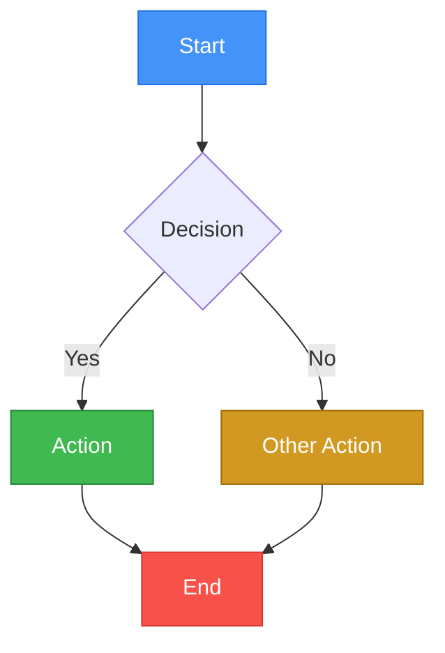

# Creating Mermaid Diagrams

## Quick Start

Wrap mermaid in a fenced code block for GitHub:

~~~markdown

~~~

Always include `accTitle` and `accDescr` for accessibility.

## Design Philosophy

Start with structure. Add styling only where it earns its place. See
`references/style-guide.md` for the full guide. The priority order:

1. **Structure** -- Shapes carry meaning (diamonds=decisions, cylinders=storage, pills=terminals)
2. **Edge weight** -- `==>` for happy path, `-->` for standard, `-.->` for optional/fallback
3. **Color** -- Reinforces meaning, never carries it alone. Most nodes should be neutral.
4. **Emphasis** -- stroke-width, dashed borders, emoji, bold labels -- only to solve specific problems

## Workflow

1. **Choose diagram type** -- Match the user's intent to a diagram type (see table below or `references/diagram-types.md` for full syntax)
2. **Write the diagram** -- Use snake_case node IDs, quote reserved words, pick shapes that match meaning
3. **Apply styling** -- Start with 0-1 colors. Add more only as the diagram demands. Pick a theme from `references/themes.md` as a palette menu.
4. **Preview** -- Local SVG via `preview.sh local` or GitHub rendering via `preview.sh gist`
5. **Embed** -- Place the fenced code block in the target markdown file

## Choosing a Diagram Type

| Use Case | Diagram Type | Keyword |
|---|---|---|
| Process flow, decision tree | `flowchart` | flowchart TD/LR |
| API call sequence, auth flow | `sequenceDiagram` | sequenceDiagram |
| Object model, inheritance | `classDiagram` | classDiagram |
| Lifecycle, transitions | `stateDiagram-v2` | stateDiagram-v2 |
| Database schema, relationships | `erDiagram` | erDiagram |
| Project timeline | `gantt` | gantt |
| Task board | `kanban` | kanban |
| Historical/event timeline | `timeline` | timeline |
| Distribution, proportions | `pie` | pie |
| 2x2 matrix, positioning | `quadrantChart` | quadrantChart |
| Line/bar chart | `xychart-beta` | xychart-beta |
| Flow volume, allocation | `sankey-beta` | sankey-beta |
| Brainstorming, hierarchy | `mindmap` | mindmap |
| System context, containers | `C4Context` | C4Context |
| Infrastructure layout | `architecture-beta` | architecture-beta |
| Block layout | `block-beta` | block-beta |
| Git history visualization | `gitGraph` | gitGraph |
| Network packets | `packet-beta` | packet-beta |
| Requirements traceability | `requirementDiagram` | requirementDiagram |

For full syntax and examples of each type, see `references/diagram-types.md`.

## GitHub Compatibility Essentials

These rules are critical. Violating them causes diagrams to silently fail on GitHub.

### Fenced Code Block Syntax

Always use triple backticks with `mermaid` language identifier:

~~~markdown

~~~

### Node ID Rules

- Use `snake_case` for all node IDs: `api_gateway`, `user_request`
- Quote labels that contain spaces or special characters: `A["My Label"]`
- Quote reserved words used as IDs: `end_node["end"]`, `class_def["class"]`
- Reserved words: `end`, `class`, `click`, `style`, `subgraph`, `default`

### Dark Mode Compatibility

GitHub renders diagrams on both light (#ffffff) and dark (#0d1117) backgrounds. Rules:

- Use **medium-to-dark fill colors** (not pastel/light) so text is readable on both
- Always set explicit `color:#fff` or `color:#000` in classDef
- Test with both backgrounds (use `preview.sh` dark mode flag)
- The default GitHub mermaid theme changes between light/dark -- custom classDef overrides this

### Accessibility

Always include accessibility metadata:


### What GitHub Does NOT Support

- `%%{init: {'theme': 'dark'}}%%` -- theme directives are **ignored**
- HTML tags in labels (`<b>`, `<br/>`) -- `\n` line breaks also do **not** work
- Nested subgraphs beyond 2 levels deep (rendering breaks)
- Diagrams with more than ~100 nodes (performance degrades)
- `click` callbacks (security restriction)
- Some beta diagram types may not be available yet

For the complete compatibility reference, see `references/github-compatibility.md`.

## Styling

Use shapes and edge weight first, then add color where it earns its place.
See `references/style-guide.md` for the full design guide.

### Shapes carry meaning

| Shape | Syntax | Use for |
|-------|--------|---------|
| Rectangle | `["Label"]` | Process, action |
| Pill | `(["Label"])` | Start/end, actor |
| Diamond | `{"Label"}` | Decision |
| Cylinder | `[("Label")]` | Database, store |
| Hexagon | `{{"Label"}}` | Exception, error |

### Edge weight tells the story

- `==>` thick -- happy path (use sparingly)
- `-->` normal -- standard flow
- `-.->` dotted -- optional, async, fallback
- `== label ==>` / `-- label -->` / `-. label .->` -- labeled variants (label syntax must match arrow type)

### Color reinforces (pick a theme from `references/themes.md`)

Most nodes should be neutral. Color only the nodes that matter: the decision,
the success outcome, the failure state.

```
%% Three-tone classDef: distinct fill, stroke, text
classDef primary fill:#89b4fa,stroke:#45475a,stroke-width:2px,color:#1e1e2e
classDef muted   fill:#6c7086,stroke:#45475a,stroke-width:1px,color:#cdd6f4
classDef success fill:#a6e3a1,stroke:#45475a,stroke-width:2px,color:#1e1e2e
classDef danger  fill:#f38ba8,stroke:#313244,stroke-width:2px,color:#1e1e2e
```

### Full toolkit (use to solve specific problems)

- **stroke-width**: 3px on key nodes, 2px default, 1px to recede
- **stroke-dasharray:5**: dashed borders for external/optional systems
- **rx/ry**: corner radius (rx:2 sharp, rx:8 soft, rx:12 round -- pick one per diagram)
- **Emoji**: only at boundaries (actors, external systems) -- not every node
- **`**Bold**` in labels**: highlight a key word when scanning matters
- **linkStyle**: color/weight per edge -- `linkStyle 0 stroke:#89b4fa,stroke-width:3px`

For themed palettes (Dracula, Nord, Catppuccin, etc.), see `references/themes.md`.
For the full design guide, see `references/style-guide.md`.

## Preview Workflow

### Local Preview (SVG/PNG)

Requires: `npx @mermaid-js/mermaid-cli` (installed on first use)

```bash
# Preview a .mmd file as SVG (opens in browser)
bash ~/.claude/skills/creating-mermaid-diagrams/scripts/preview.sh local diagram.mmd

# Preview with dark background
bash ~/.claude/skills/creating-mermaid-diagrams/scripts/preview.sh local diagram.mmd --dark

# Extract mermaid from a markdown file and preview
bash ~/.claude/skills/creating-mermaid-diagrams/scripts/preview.sh local README.md
```

The script:
1. Extracts mermaid code from markdown if needed
2. Runs `npx -y @mermaid-js/mermaid-cli mmdc` to generate SVG
3. Optionally generates a dark-background version
4. Opens the SVG in the default browser

### GitHub Preview (Private Gist)

Requires: `gh` CLI authenticated

```bash
# Create a private gist with the diagram and open in browser
bash ~/.claude/skills/creating-mermaid-diagrams/scripts/preview.sh gist diagram.md

# If input is .mmd, it will be wrapped in a markdown code block automatically
bash ~/.claude/skills/creating-mermaid-diagrams/scripts/preview.sh gist diagram.mmd
```

The script:
1. Wraps raw mermaid in a markdown fenced code block if needed
2. Creates a private gist via `gh gist create`
3. Tracks the gist ID in `~/.cache/mermaid-preview-gists.txt`
4. Prints the gist URL
5. Opens the URL in the default browser

This is the most accurate preview since it uses GitHub's actual renderer.

## Gist Management

Preview gists accumulate over time. Use these commands to manage them:

```bash
# List all tracked preview gists
bash ~/.claude/skills/creating-mermaid-diagrams/scripts/preview.sh list

# Show gists that can be cleaned up (does NOT delete)
bash ~/.claude/skills/creating-mermaid-diagrams/scripts/preview.sh cleanup
```

The `cleanup` command lists tracked gists but does **not** delete them automatically. After running cleanup, Claude should present the list to the user and ask for confirmation before deleting each gist:

```bash
# Delete a specific gist (only after user confirmation)
gh gist delete GIST_ID
```

After deletion, the gist ID is removed from the tracking file.

**Important**: Never delete gists without explicit user confirmation. Always show the gist URL and creation date before asking.

## Output Format

When creating a diagram for the user, always output it in this format:

~~~markdown
```mermaid
[diagram type]
    accTitle: [Brief title]
    accDescr: [One-sentence description of what the diagram shows]

    [diagram content]

    [classDef declarations]
    [class assignments]
```
~~~

## References

- **Diagram types and syntax**: `references/diagram-types.md`
- **GitHub rendering details**: `references/github-compatibility.md`
- **Styling patterns**: `references/style-guide.md`
- **Color themes**: `references/themes.md`
- **Preview scripts**: `scripts/preview.sh`, `scripts/theme-preview.sh`
