# Mermaid Diagram Types Reference

Quick reference for all Mermaid diagram types. Each entry includes: when to use, a minimal working example, and GitHub-specific tips where applicable.

---

## Core Diagrams

### Flowchart

**Syntax:** `flowchart TD` (top-down) or `flowchart LR` (left-right)
**Use when:** Modeling process flows, decision trees, or any directed graph.

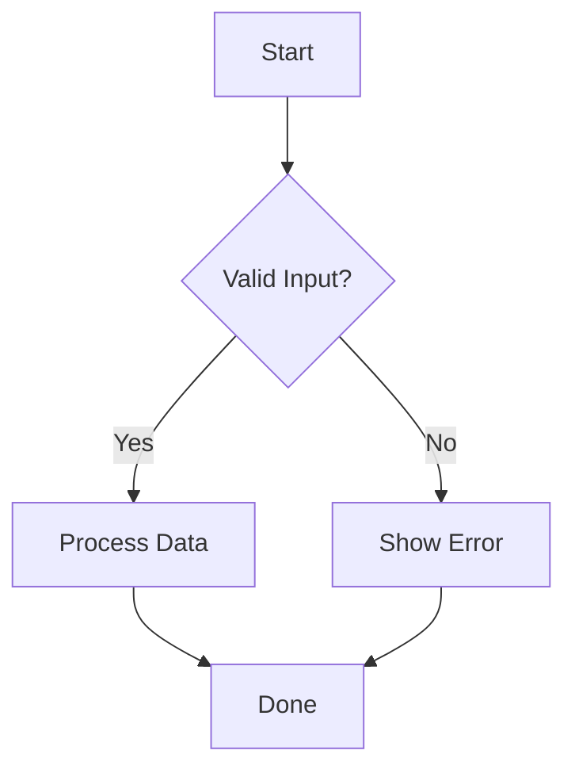

**GitHub tips:**
- Use `accTitle` and `accDescr` in frontmatter for accessibility (recommended on all diagrams, shown here as a reminder).
- `TD`/`TB` for top-down, `LR` for left-right, `RL` for right-left, `BT` for bottom-top.
- Keep node IDs in snake_case for readability in source.

---

### Sequence Diagram

**Syntax:** `sequenceDiagram`
**Use when:** Illustrating API calls, authentication flows, or message passing between actors.

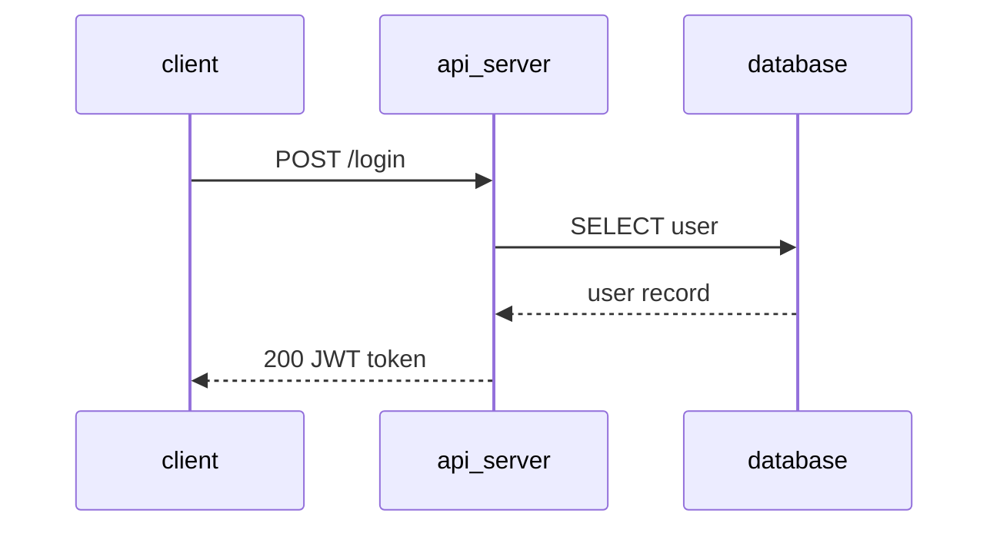

**GitHub tips:**
- Use `->>` for solid arrows (requests) and `-->>` for dashed arrows (responses).
- `participant` declares order; `actor` renders a person icon instead of a box.
- Long diagrams render better with `autonumber` to label each step.

---

### Class Diagram

**Syntax:** `classDiagram`
**Use when:** Documenting object models, inheritance hierarchies, or interface contracts.

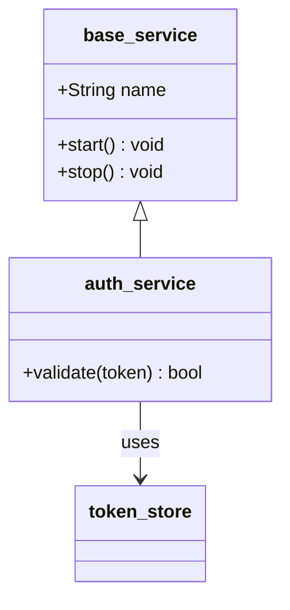

**GitHub tips:**
- Use `<|--` for inheritance, `-->` for association, `*--` for composition, `o--` for aggregation.
- Visibility: `+` public, `-` private, `#` protected, `~` package.

---

### State Diagram

**Syntax:** `stateDiagram-v2`
**Use when:** Modeling lifecycles, state machines, or transition logic.

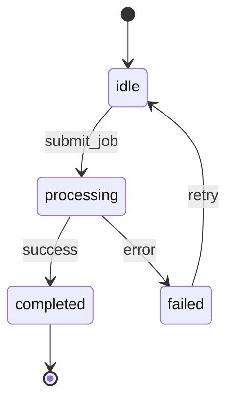

**GitHub tips:**
- Use `v2` syntax; the original `stateDiagram` is deprecated.
- `[*]` represents start and end pseudo-states.
- Nest states with `state parent_state { ... }` for composite states.

---

### ER Diagram

**Syntax:** `erDiagram`
**Use when:** Documenting database schemas or entity relationships.

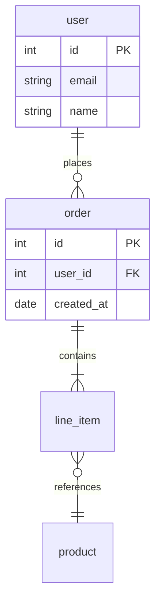

**GitHub tips:**
- Relationship syntax: `||` exactly one, `o|` zero or one, `}|` one or more, `}o` zero or more.
- Mark keys with `PK`, `FK`, `UK` after the column name.

---

## Project Diagrams

### Gantt

**Syntax:** `gantt`
**Use when:** Showing project timelines, phase schedules, or task dependencies.

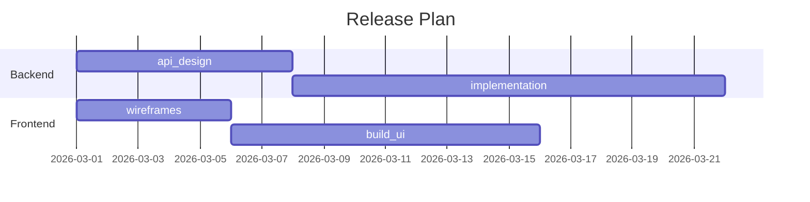

**GitHub tips:**
- Tasks can use `done`, `active`, `crit` markers for status and priority.
- `after a1` creates dependency links between tasks.

---

### Kanban

**Syntax:** `kanban`
**Use when:** Representing task boards or workflow stages.

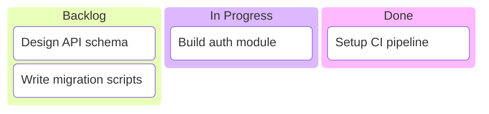

**GitHub tips:**
- Kanban is a newer diagram type; verify rendering support in your target GitHub environment.
- Column names are plain text; tasks use bracket syntax for IDs and labels.

---

### Timeline

**Syntax:** `timeline`
**Use when:** Showing historical events, milestones, or chronological progressions.

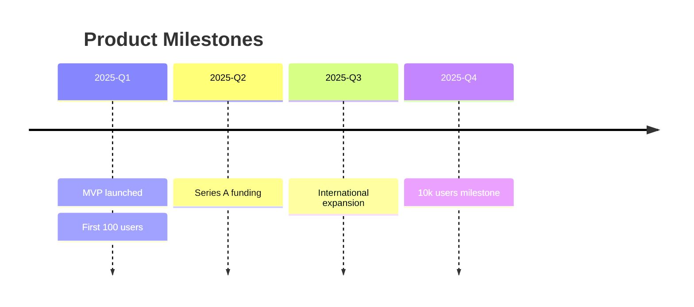

**GitHub tips:**
- Each time period can have multiple events separated by newlines with `:`.
- Titles are optional but recommended for context.

---

### Requirement Diagram

**Syntax:** `requirementDiagram`
**Use when:** Tracking requirements traceability or linking requirements to design elements.

```mermaid
requirementDiagram
    requirement auth_requirement {
        id: REQ-001
        text: System shall authenticate users via OAuth2
        risk: medium
        verifymethod: test
    }
    element auth_module {
        type: module
    }
    auth_module - satisfies -> auth_requirement
```

**GitHub tips:**
- Relationship types: `satisfies`, `traces`, `contains`, `derives`, `refines`, `copies`.
- `risk` accepts `low`, `medium`, `high`; `verifymethod` accepts `test`, `inspection`, `analysis`, `demonstration`.

---

## Data Diagrams

### Pie Chart

**Syntax:** `pie`
**Use when:** Showing distribution or proportions of a whole.

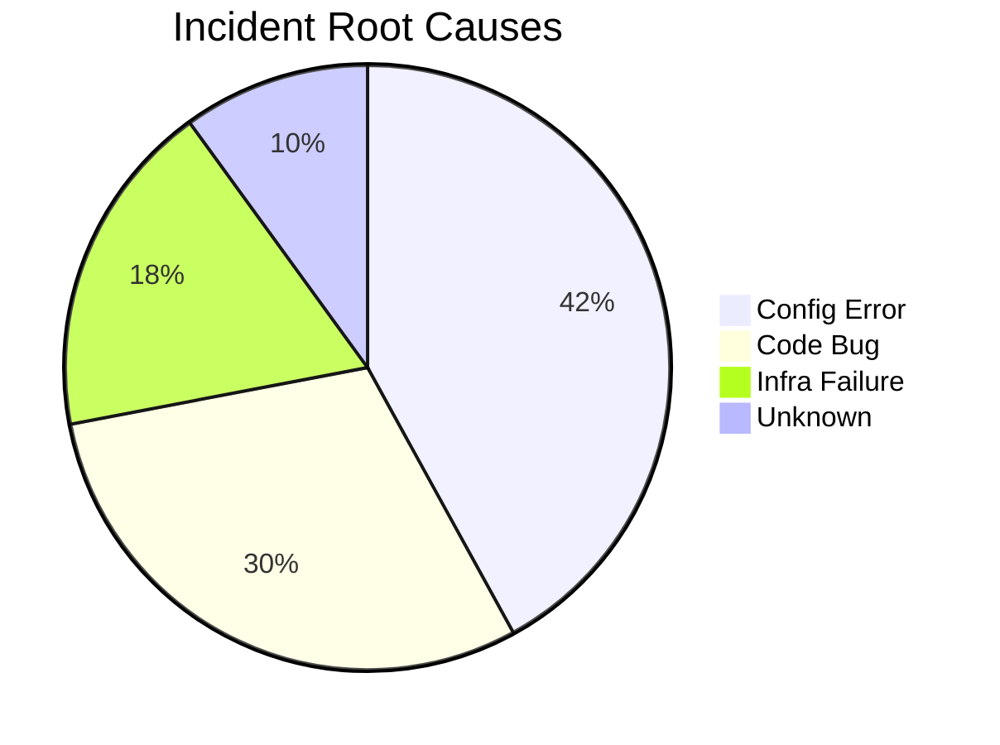

**GitHub tips:**
- Values are relative; Mermaid calculates percentages automatically.
- Keep to 6 or fewer slices for readability.

---

### Quadrant Chart

**Syntax:** `quadrantChart`
**Use when:** Creating 2x2 matrices for priority/effort mapping or strategic positioning.

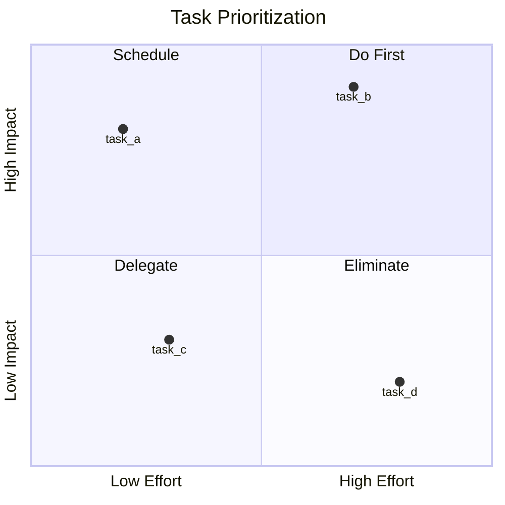

**GitHub tips:**
- Coordinates are normalized 0.0 to 1.0 for both axes.
- Quadrants are numbered: 1=top-right, 2=top-left, 3=bottom-left, 4=bottom-right.

---

### XY Chart

**Syntax:** `xychart-beta`
**Use when:** Creating line charts or bar charts from data series.

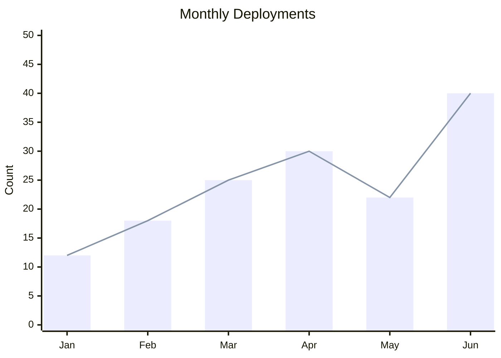

**GitHub tips:**
- Beta syntax; may change in future Mermaid versions.
- Supports `bar` and `line` series; both can coexist in one chart.

---

### Sankey Diagram

**Syntax:** `sankey-beta`
**Use when:** Visualizing flow volume, resource allocation, or conversion funnels.

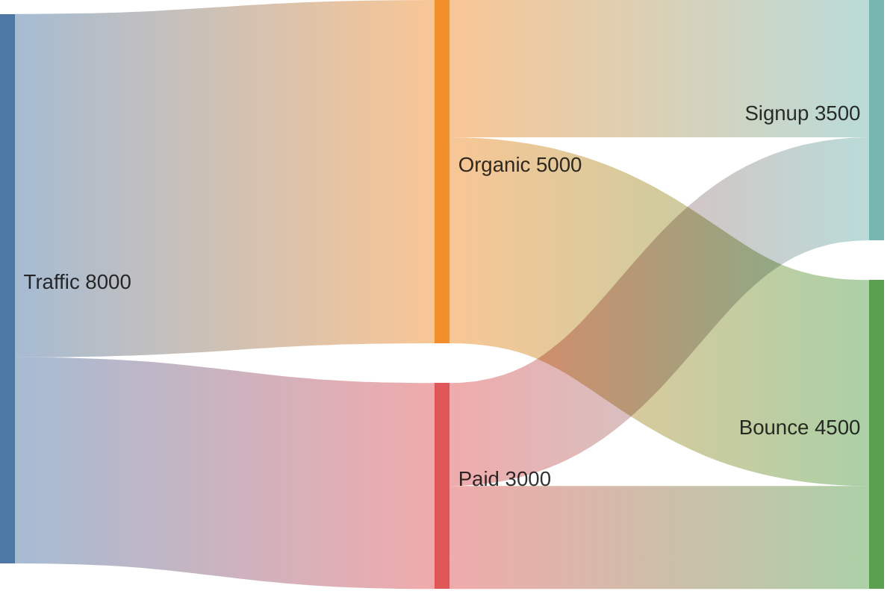

**GitHub tips:**
- Uses CSV-like syntax: `source,target,value` with each flow on its own line.
- A blank line after the directive is required before the data rows.
- Keep node names short; long labels can clip.

---

## Architecture Diagrams

### C4 Context

**Syntax:** `C4Context`
**Use when:** Creating system context diagrams following the C4 model.

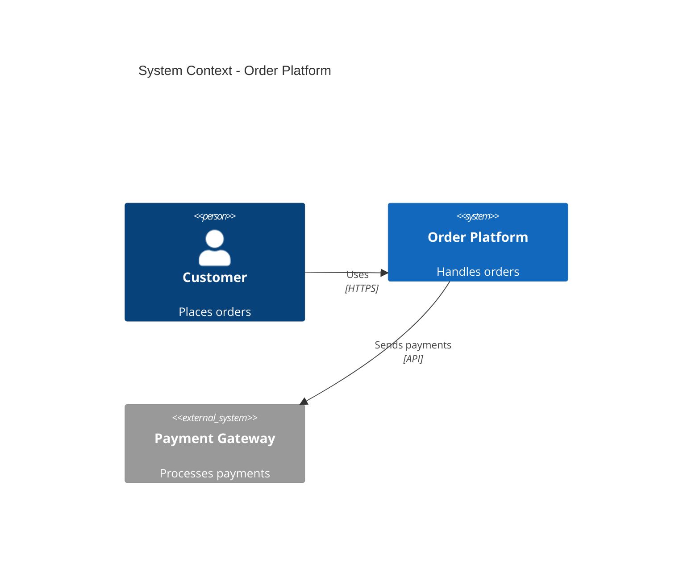

**GitHub tips:**
- Also supports `C4Container`, `C4Component`, and `C4Deployment` for deeper levels.
- Use `System_Ext` for external systems, `System_Boundary` for grouping.
- `Rel` defines relationships with optional description and technology.

---

### Architecture

**Syntax:** `architecture-beta`
**Use when:** Illustrating infrastructure layout or cloud architecture.

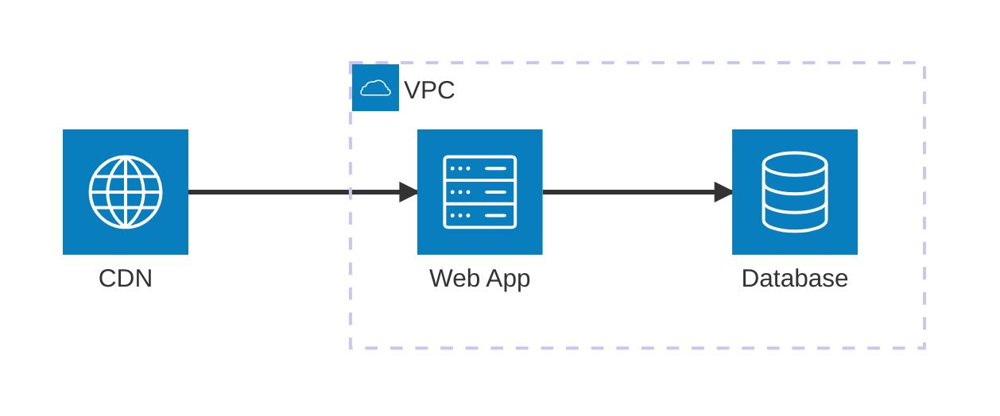

**GitHub tips:**
- Beta syntax; icon names in parentheses are from a built-in icon set (`server`, `database`, `internet`, `cloud`, `disk`).
- Positioning hints use `L`, `R`, `T`, `B` for left, right, top, bottom.
- `group` creates visual boundaries; `in` places services inside groups.

---

### Block Diagram

**Syntax:** `block-beta`
**Use when:** Creating block-based layouts or component diagrams with spatial positioning.

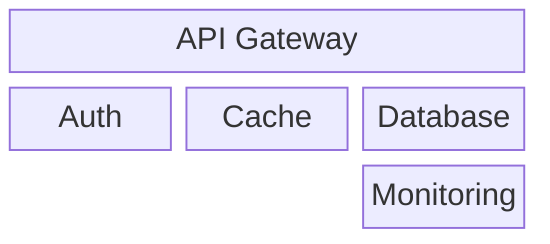

**GitHub tips:**
- `columns N` sets the grid width; blocks span columns with `:N` suffix.
- `space` inserts empty cells for layout control.
- Beta syntax; good for structured layouts that flowcharts handle awkwardly.

---

## Other Diagrams

### Mindmap

**Syntax:** `mindmap`
**Use when:** Brainstorming, showing hierarchical concepts, or organizing ideas.

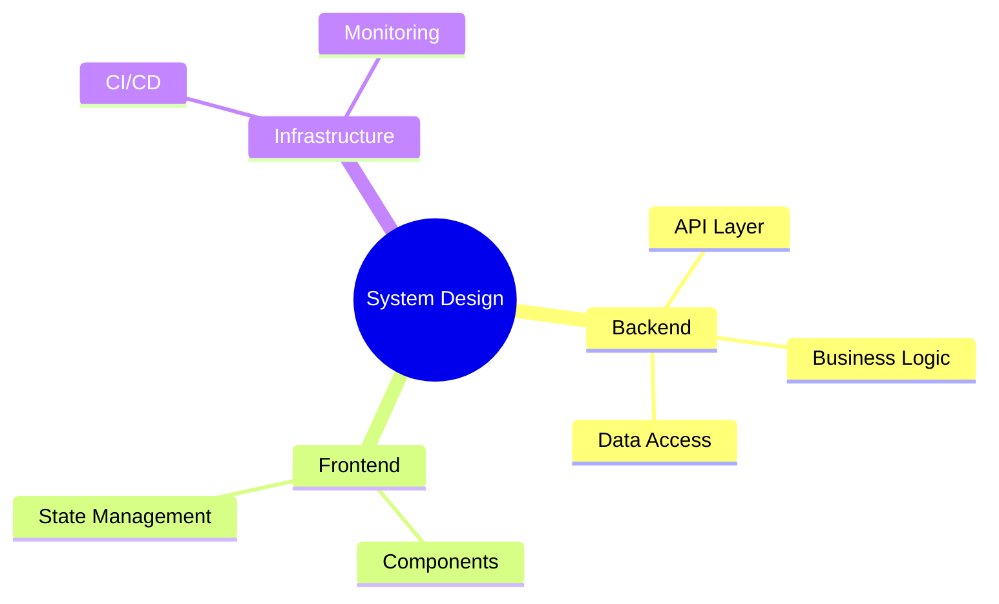

**GitHub tips:**
- Indentation defines hierarchy (use consistent spacing).
- Root shape: `((circle))`, `[square]`, `(rounded)`, or plain text.
- No explicit connections; hierarchy is implied by nesting.

---

### ZenUML

**Syntax:** `zenuml`
**Use when:** Preferring code-like syntax for sequence diagrams.

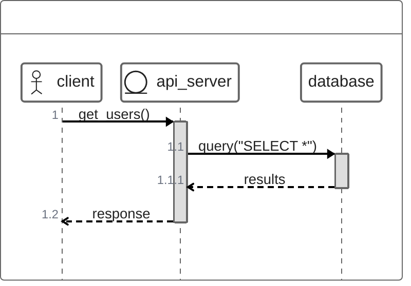

**GitHub tips:**
- Alternative to `sequenceDiagram` with a more programming-language feel.
- Uses method call syntax and curly braces for nested interactions.
- Verify GitHub rendering support; ZenUML may require a newer Mermaid version.

---

### Packet Diagram

**Syntax:** `packet-beta`
**Use when:** Documenting network packet structures or binary data formats.

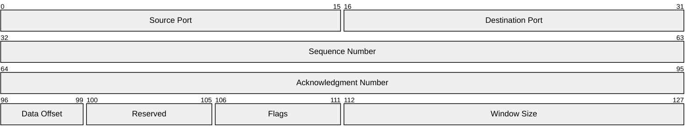

**GitHub tips:**
- Bit ranges use `start-end: "label"` syntax.
- Beta feature; useful for protocol documentation and RFC-style diagrams.
- Renders as a structured bit-field table.

---

### Git Graph

**Syntax:** `gitGraph`
**Use when:** Visualizing branching strategies, merge flows, or release processes.

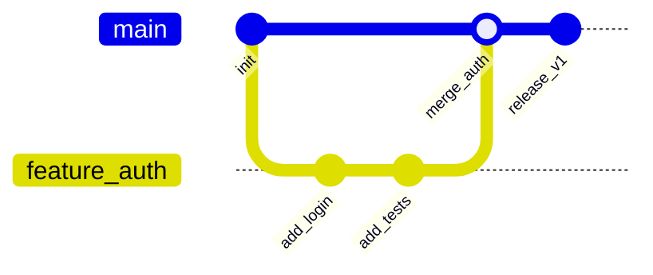

**GitHub tips:**
- Branch names cannot contain spaces; use snake_case or kebab-case.
- `cherry-pick` is supported for showing cherry-pick operations.
- Default branch is `main`; customize with `commit`, `branch`, `checkout`, `merge` commands.

---

## Quick Selection Guide

| Need to show...            | Use              | Syntax keyword       |
|----------------------------|------------------|----------------------|
| Process or logic flow      | Flowchart        | `flowchart`          |
| API or message exchange    | Sequence Diagram | `sequenceDiagram`    |
| Object model               | Class Diagram    | `classDiagram`       |
| State transitions          | State Diagram    | `stateDiagram-v2`    |
| Database schema            | ER Diagram       | `erDiagram`          |
| Project schedule           | Gantt            | `gantt`              |
| Task board                 | Kanban           | `kanban`             |
| Chronological events       | Timeline         | `timeline`           |
| Requirements tracing       | Requirement      | `requirementDiagram` |
| Proportions                | Pie Chart        | `pie`                |
| 2x2 matrix                 | Quadrant Chart   | `quadrantChart`      |
| Line/bar chart             | XY Chart         | `xychart-beta`       |
| Flow volumes               | Sankey           | `sankey-beta`        |
| System context (C4)        | C4 Context       | `C4Context`          |
| Infrastructure layout      | Architecture     | `architecture-beta`  |
| Block layout               | Block Diagram    | `block-beta`         |
| Idea hierarchy             | Mindmap          | `mindmap`            |
| Sequence (code-style)      | ZenUML           | `zenuml`             |
| Packet/binary structure    | Packet           | `packet-beta`        |
| Git branching              | Git Graph        | `gitGraph`           |
