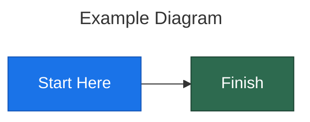

# GitHub Mermaid Rendering: Compatibility and Edge Cases

Deep reference for producing mermaid diagrams that render correctly on GitHub
across themes, devices, and repository contexts.

---

## 1. Rendering Mechanism

GitHub does **not** render mermaid client-side. The pipeline works as follows:

- A fenced ```` ```mermaid ```` block is detected during Markdown processing.
- The content is sent to GitHub's **Viewscreen** service, which renders the
  diagram server-side into an SVG.
- The SVG is returned inside a sandboxed `<iframe>` embedded in the page.
- No JavaScript from the diagram source is ever executed in the viewer.

Implications:

- Interactive features (click events, callbacks, links) do **not** work.
- Any directive that relies on client-side JS is silently ignored.
- Rendering latency depends on Viewscreen availability; complex diagrams may
  time out with no error message (the block simply shows as raw text).

---

## 2. Dark Mode Behavior

GitHub supports multiple color themes. The two extremes are:

| Theme         | Background | Text default |
|---------------|-----------|--------------|
| Light default | `#ffffff` | `#1f2328`    |
| Dark default  | `#0d1117` | `#e6edf3`    |

When dark mode is active, GitHub instructs Viewscreen to use the mermaid
`dark` theme instead of `default`. This changes node fills, stroke colors,
and label colors automatically.

**Problem:** If you use `classDef` with light pastel fills (e.g., `#e8f4fd`),
those nodes become nearly invisible against the dark background.

**Rules for theme-safe styling:**

- Use medium-to-dark fill colors (`#1a73e8`, `#2d6a4f`, `#b45309`).
- Always set an explicit `color` (text) property in every `classDef`.
- Avoid pastel or near-white fills entirely.
- Test by toggling GitHub's Appearance setting between light and dark.
- When in doubt, use high-contrast combinations: light text on dark fill.

```
classDef safe fill:#1a73e8,stroke:#1456b8,color:#ffffff
classDef warning fill:#b45309,stroke:#8a3a04,color:#ffffff
```

---

## 3. Reserved Words

The following words are reserved in mermaid's grammar and **cannot** be used
as bare node IDs. Using them bare will cause parse errors or silent failures.

```
end          class        click        style
subgraph     default      graph        flowchart
sequenceDiagram           classDiagram
stateDiagram              erDiagram
gantt        pie          gitGraph
```

**Workaround:** Quote them inside a label bracket on the node definition:

```
end_node["end"]
class_node["class"]
default_node["default"]
```

Always prefer descriptive IDs (`process_end`, `style_config`) over the bare
reserved word, even when quoting.

---

## 4. Init Directives Are Ignored

The `%%{init: {...}}%%` directive syntax is a standard mermaid feature for
setting themes and theme variables at the diagram level. Example:

```
%%{init: {'theme': 'forest', 'themeVariables': {'primaryColor': '#ff0000'}}}%%
```

**GitHub strips or ignores these directives entirely.** They have no effect
on the rendered output. Do not rely on them.

The **only** mechanism for custom styling on GitHub is `classDef` combined
with `class` assignments or the `:::` shorthand syntax.

---

## 5. HTML in Labels

Standard mermaid supports a subset of HTML in labels (`<b>`, `<br/>`, `<i>`,
`<u>`, `<sub>`, `<sup>`). GitHub's renderer does **not** support these.

What happens on GitHub:

- HTML tags are rendered as literal text (you see `<b>text</b>` in the node).
- In some cases the tag causes a parse failure and the diagram does not render.

**Alternatives:**

- For line breaks: `\n` does **not** work on GitHub's renderer. Split long
  labels into multiple connected nodes or keep labels concise.
- For emphasis: use Markdown `**bold**` in labels (confirmed working on GitHub),
  or rely on UPPERCASE and structural separation.
- For complex formatted labels: split into multiple connected nodes.

---

## 6. Node ID Rules

Mermaid node IDs are used internally for wiring edges and applying classes.
GitHub's renderer is strict about malformed IDs.

**Recommended conventions:**

| Rule                        | Example              |
|-----------------------------|----------------------|
| Use `snake_case`            | `user_service`       |
| Start with a letter         | `a1_node` not `1node`|
| No spaces                   | `my_node` not `my node`|
| No special chars except `_` | `data_store` not `data-store`|
| Labels in brackets          | `my_node["Display Label"]`|

Hyphens (`-`) can work in some diagram types but cause ambiguity with edge
syntax in flowcharts. Stick to underscores for portability.

---

## 7. Size Limits

GitHub's Viewscreen imposes a rendering timeout. Observations:

- Diagrams with **fewer than 50 nodes** render reliably.
- Diagrams with **50-100 nodes** may render slowly but usually succeed.
- Diagrams with **100+ nodes** frequently time out or fail silently.
- Very long labels or deeply nested subgraphs increase render time
  disproportionately.

**Mitigation strategies:**

- Break large architectures into focused sub-diagrams (one per subsystem).
- Use a top-level overview diagram that references sub-diagram files.
- Collapse detail into subgraphs only when the contained nodes are few.
- Prefer short labels with detail in surrounding prose.

---

## 8. Emoji Handling

| Syntax                     | Works on GitHub? |
|----------------------------|------------------|
| Unicode emoji (`U+1F680`)  | Yes              |
| Pasted emoji glyph         | Yes              |
| GitHub shortcodes `:rocket:` | **No**         |

GitHub-flavored emoji shortcodes (`:emoji_name:`) are processed in Markdown
**outside** of fenced code blocks. Inside a ```` ```mermaid ```` block, the
content is sent raw to Viewscreen, which does not expand shortcodes.

Use the actual Unicode character instead:

```
deploy["Deploy to Prod 🚀"]
```

---

## 9. Supported Diagram Types

As of early 2026, GitHub supports the following mermaid diagram types:

**Stable and well-supported:**

- `flowchart` / `graph` (LR, TD, etc.)
- `sequenceDiagram`
- `classDiagram`
- `stateDiagram-v2`
- `erDiagram`
- `gantt`
- `pie`
- `gitGraph`

**Supported but less tested on GitHub:**

- `C4Context` (C4 diagrams)
- `mindmap`
- `timeline`
- `sankey-beta`
- `xychart-beta`

**Potentially unavailable or unreliable:**

- Very new or experimental diagram types added in the latest mermaid releases
  may not be available until GitHub updates its Viewscreen dependency.
- `zenuml` support is inconsistent.
- `block-beta` may not be supported depending on the mermaid version deployed.

Always verify new diagram types render on GitHub before committing them to
documentation that others depend on.

---

## 10. Pre-commit Checklist

Run through this checklist before committing any mermaid diagram to a
GitHub-hosted repository:

```
[ ] No %%{init: ...}%% directives present
[ ] No HTML tags in labels (<b>, <br/>, <i>, etc.)
[ ] All node IDs are snake_case (letters, digits, underscores only)
[ ] Node IDs start with a letter, not a digit
[ ] Reserved words used as labels are quoted: reserved_node["end"]
[ ] accTitle and accDescr are present for accessibility
[ ] Every classDef includes an explicit color (text) property
[ ] Fills are medium-to-dark (not pastel, not near-white)
[ ] No GitHub emoji shortcodes inside the mermaid block
[ ] Diagram has fewer than ~100 nodes
[ ] Tested rendering on both GitHub light and dark themes
[ ] No click/callback directives (they are non-functional)
```

---

## Quick Reference: Minimal Safe Template


