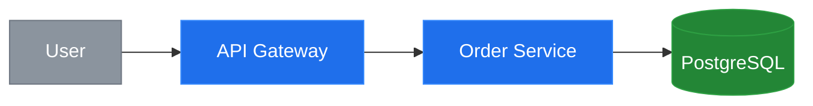

# Mermaid Style Guide — Palette-Agnostic Patterns

Reusable styling patterns for Mermaid diagrams. These patterns define
**structure and semantics** rather than specific colors, so they compose
cleanly with any theme from `themes.md`.

---

## 1. Semantic classDef Patterns

Define classes by the **role** a node plays, not by its visual appearance.
Each theme supplies concrete fill/stroke/color values for these class names.

```mermaid
%% Generic classDef templates — replace <fill>, <stroke>, <color> with theme values

classDef service   fill:<fill>,stroke:<stroke>,color:<color>
classDef database  fill:<fill>,stroke:<stroke>,color:<color>
classDef user      fill:<fill>,stroke:<stroke>,color:<color>
classDef external  fill:<fill>,stroke:<stroke>,color:<color>
classDef decision  fill:<fill>,stroke:<stroke>,color:<color>
classDef error     fill:<fill>,stroke:<stroke>,color:<color>
```

| Class      | When to use                                      |
|------------|--------------------------------------------------|
| `service`  | Microservices, APIs, internal application nodes   |
| `database` | Data stores — SQL, NoSQL, caches, queues          |
| `user`     | Human actors, user-facing entry points             |
| `external` | Third-party systems, SaaS integrations             |
| `decision` | Conditional/branching nodes, gates, feature flags  |
| `error`    | Error states, failure paths, dead-letter queues    |

Apply a class to a node after defining it:

```mermaid
A["API Gateway"]
class A service
```

Or inline with `:::`:

```mermaid
A["API Gateway"]:::service --> B["PostgreSQL"]:::database
```

---

## 2. Edge Styling

Mermaid edges are styled by their **link index** (0-based, in declaration order).

### Common patterns

```mermaid
%% Default edge style — applies to all edges unless overridden
linkStyle default stroke:#8b949e,stroke-width:2px

%% Primary / happy path — thicker, accent color
linkStyle 0 stroke:#4493f8,stroke-width:3px

%% Optional or secondary path — dashed
linkStyle 1 stroke:#8b949e,stroke-width:2px,stroke-dasharray:5

%% Error / failure path — red-toned
linkStyle 2 stroke:#f85149,stroke-width:2px
```

### Labeled edges

Use quoted labels to keep text readable:

```mermaid
A -->|"200 OK"| B
A -->|"500 Error"| C
A -.->|"optional"| D
```

Arrow variants quick reference:

| Syntax   | Meaning              |
|----------|----------------------|
| `-->`    | Solid arrow          |
| `-..->`  | Dotted arrow         |
| `-.->`   | Dashed arrow         |
| `==>`    | Thick arrow          |
| `--x`    | Cross end            |
| `--o`    | Circle end           |

---

## 3. Accessibility Patterns

Always add `accTitle` and `accDescr` to every diagram. Screen readers and
GitHub's accessibility layer use these values.

### Rules

- **accTitle**: Under 50 characters. A short label for the diagram.
- **accDescr**: Describe what the diagram **communicates**, not its structure.
  Say "Shows how a request flows from user to database" rather than
  "Flowchart with six nodes and five edges."

### Examples by diagram type

**Flowchart**
```mermaid
flowchart LR
    accTitle: Request lifecycle
    accDescr: Shows how an API request flows through auth, processing, and storage layers.
```

**Sequence**
```mermaid
sequenceDiagram
    accTitle: Login handshake
    accDescr: Illustrates the OAuth token exchange between client, auth server, and API.
```

**ER Diagram**
```mermaid
erDiagram
    accTitle: User data model
    accDescr: Describes relationships between users, teams, and permissions tables.
```

**State Diagram**
```mermaid
stateDiagram-v2
    accTitle: Order states
    accDescr: Maps the lifecycle of an order from placement through fulfillment or cancellation.
```

**Gantt Chart**
```mermaid
gantt
    accTitle: Q2 roadmap
    accDescr: Summarizes planned milestones and dependencies for the Q2 release cycle.
```

---

## 4. Subgraph Styling

Subgraphs group related nodes. Style them with **muted, low-contrast
backgrounds** so the nodes inside remain visually prominent.

```mermaid
subgraph sg_backend["Backend Services"]
    style sg_backend fill:#1c2128,stroke:#30363d,color:#8b949e
    A["Auth Service"]:::service
    B["Order Service"]:::service
end
```

### Guidelines

- Use `fill` values darker / more muted than node fills to maintain contrast.
- Always set `color` on the subgraph so the label text is legible.
- Use `snake_case` identifiers prefixed with `sg_` for subgraph IDs to avoid
  collisions with node IDs.
- Quote the display name: `subgraph sg_id["Human Readable Name"]`.
- Nest subgraphs sparingly — two levels deep is usually the practical maximum.

```mermaid
subgraph sg_infra["Infrastructure"]
    style sg_infra fill:#161b22,stroke:#30363d,color:#8b949e

    subgraph sg_compute["Compute"]
        style sg_compute fill:#1c2128,stroke:#30363d,color:#8b949e
        K8["Kubernetes"]:::service
    end
end
```

---

## 5. Applying a Theme

Themes live in `themes.md`. Each theme provides a complete set of `classDef`
lines that map the semantic class names from Section 1 to concrete colors.

### Steps

1. **Choose a theme** from `themes.md` (e.g., `github-dark`, `github-light`).
2. **Copy the classDef block** from that theme.
3. **Define your nodes and edges** first — keep structure separate from style.
4. **Paste the classDef block** after the node definitions.
5. **Apply classes** to each node using `class node_id class_name`.



### Notes

- Theme `classDef` lines **override** any default styling Mermaid applies.
- You can mix theme classes with custom `linkStyle` rules freely.
- If a theme does not define a class you need, add a one-off `classDef`
  below the theme block — it will not conflict.
