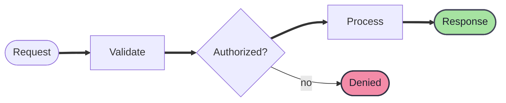
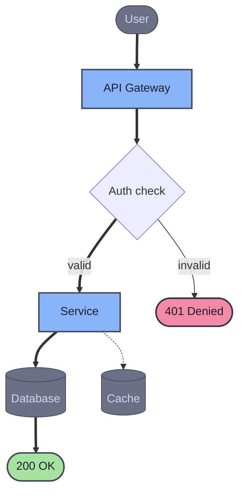
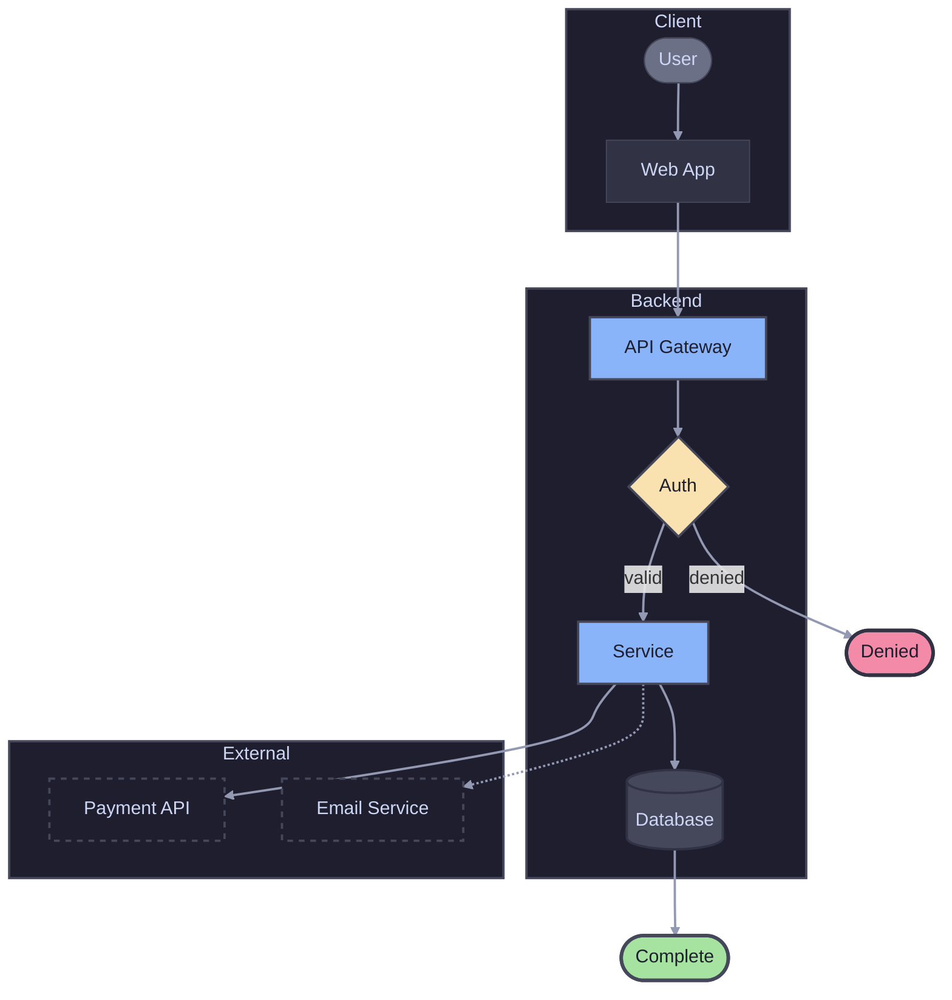

# Mermaid Diagram Style Guide

## Philosophy

Start with nothing. Add only what earns its place.

A well-designed diagram communicates through structure first, then uses color,
weight, and detail as reinforcement -- never as the primary carrier of meaning.
If you strip all styling from a diagram and it stops making sense, the styling
was doing too much work.

## Platform: GitHub Markdown

This guide targets GitHub's Mermaid renderer (markdown files, PRs, issues,
comments). GitHub imposes constraints that shape every decision here:

- **No `%%{init}` directives** -- theme config is ignored. `classDef` is the
  only way to style.
- **No inline `style` on nodes** -- use `classDef` + `class` assignment.
  (`style` on subgraphs is the exception -- that does work.)
- **No HTML in labels** -- no `<b>`, `<br/>`, `<i>`. Markdown `**bold**` works
  in labels. `\n` for line breaks does **not** work on GitHub.
- **Two backgrounds** -- GitHub renders on white (#ffffff) in light mode and
  dark (#0d1117) in dark mode. You can't control this. Every fill color must
  be readable against both.
- **~100 node limit** -- larger diagrams degrade or timeout. Split them.
- **No click callbacks** -- interactive features are stripped.
- **No emoji shortcodes** -- `:rocket:` doesn't work. Use Unicode emoji directly.

These constraints are why we use `classDef` with explicit fill/stroke/color,
medium-toned fills, and structural techniques (shapes, edge weight) over
color-dependent styling.

## The Toolkit

Every visual property in Mermaid can carry meaning. Use them in this priority
order -- earlier tools solve most problems, later tools are seasoning.

### 1. Structure (always use)

**Node shapes** tell the reader what kind of thing something is before they
read the label:

| Shape | Syntax | Meaning |
|-------|--------|---------|
| Rectangle | `["Label"]` | Process, action, step |
| Rounded | `("Label")` | Soft boundary, general container |
| Pill / stadium | `(["Label"])` | Start point, end point, actor |
| Diamond | `{"Label"}` | Decision, branch, condition |
| Hexagon | `{{"Label"}}` | Exception, special case, manual step |
| Cylinder | `[("Label")]` | Database, data store, cache |
| Subroutine | `[["Label"]]` | Subprocess, grouped action |
| Asymmetric | `>"Label"]` | Event, trigger, external signal |

Pick shapes that match meaning. A database should be a cylinder whether or
not you add color. A decision should be a diamond. This is free communication.

**Direction** sets the reading flow. `LR` (left-to-right) suits pipelines and
sequences. `TD` (top-down) suits hierarchies and request flows. Pick the one
that matches the story's natural direction.

**Subgraphs** group related nodes. Use them when there's a genuine boundary
(a service, an environment, a phase) -- not just to organize visually.

### 2. Edge weight (use when there's a narrative)

Edges tell the reader which path to follow:

| Edge | Syntax | When to use |
|------|--------|-------------|
| Normal | `-->` | Default. Most edges should be this. |
| Thick | `==>` | The happy path. The main storyline the reader should follow. |
| Dotted | `-.->` | Optional, async, fallback, recovery, or "sometimes" paths. |

**Labeled edges** -- use matching syntax for the arrow type:

| Type | Syntax |
|------|--------|
| Normal labeled | `-- text -->` or `-->\|"text"\|` |
| Thick labeled | `== text ==>` |
| Dotted labeled | `-. text .->` |

Never mix label syntax with a different arrow type (e.g., `-- text ==>` is a
parse error on GitHub).

Use `==>` sparingly. If every edge is thick, none of them are. One continuous
thick path through the diagram creates a visual narrative the eye can follow.

### 3. Color (use when status or role matters)

Color reinforces meaning that's already established by structure. Apply it
using `classDef` + `:::className` shorthand or `class nodeName className`.

**How many colors per diagram:**

| Diagram complexity | Colors to use |
|-------------------|---------------|
| Simple (3-6 nodes) | 0-1 accent color. Structure does the work. |
| Medium (7-15 nodes) | 2-3 colors. One for the main role, one for contrast (success/failure, internal/external). |
| Complex (15+ nodes) | 3-5 colors. Use a theme palette, but still leave most nodes neutral. |

The mistake is coloring every node. Most nodes should be neutral -- muted or
secondary from your theme. Color draws attention to the nodes that matter:
the decision point, the success outcome, the failure state, the external
dependency.

**Three-tone classDef:** Always use distinct fill, stroke, and text colors.
The fill carries the color identity, the stroke provides definition (use the
theme's structural/dark color), and the text ensures readability. On GitHub,
always set `color` explicitly -- dark mode can make default text invisible.

```
classDef success fill:#a6e3a1,stroke:#45475a,stroke-width:2px,color:#1e1e2e
```

### 4. Emphasis (use to solve specific problems)

These tools solve specific communication problems. Don't apply them by default.

**stroke-width** -- When some nodes genuinely need more visual weight. Use 3px
on 1-3 key nodes (a critical decision, the final outcome), 2px as the default,
1px on infrastructure that should recede.

**stroke-dasharray** -- Dashed node borders signal "this is different from the
others." Use for external systems, optional components, or planned-but-not-built
elements. `stroke-dasharray:5` in a classDef.

**rx/ry (corner radius)** -- Sets the visual personality. Sharp corners (rx:2)
feel precise and technical. Rounded (rx:8-12) feel approachable. Pick one value
and use it across all classDefs in a diagram. Don't mix.

**Emoji** -- Use at genuine boundaries: the human actor at the start, the
database, the external system. If every node has an emoji, they become noise.
One or two emoji can anchor the reader; ten is a children's menu. Remember:
only Unicode emoji work on GitHub, not `:shortcodes:`.

**Bold in labels** -- `["**Deploy** to staging"]` draws the eye to one word.
Useful when a diagram has many similar nodes and you want the reader to scan
quickly. Many diagrams don't need this at all.

**font-size / font-weight** -- Available in classDef but rarely needed.

## Applying a Theme

Themes from `themes.md` provide a color palette -- a menu, not a checklist.

1. Pick a theme matching the context (Dracula for dev-facing docs, Nord for
   something calm, Catppuccin for warmth).
2. Copy only the classDefs you need. A 3-color diagram doesn't need 10 classes.
3. At minimum: one primary color and one status color (success or danger). Add
   more only as the diagram demands.

## Subgraph Styling

Style subgraphs with the theme's darkest/base color as fill:

```
style sg_name fill:#1e1e2e,stroke:#45475a,stroke-width:2px,color:#cdd6f4
```

Subgraph backgrounds should be darker/more muted than node fills so nodes
stand out. On GitHub's dark mode, very dark subgraph fills blend into the
background -- that's fine, the stroke provides the boundary. On light mode,
the dark fill creates clear visual grouping.

## Accessibility

Every diagram must include `accTitle` and `accDescr`:

```
accTitle: CI/CD Pipeline
accDescr: Shows the flow from code commit through build, test, and deploy to production
```

- `accTitle`: 3-8 words naming the diagram
- `accDescr`: 1-2 sentences explaining what the diagram communicates

Don't rely on color alone. Shapes + edge weight + labels should make the
diagram understandable without color. This is both an accessibility
requirement and a sign of good design.

Note: some diagram types (mindmap, timeline, quadrant, sankey, xychart, block,
kanban, packet, architecture) do not support `accTitle`/`accDescr`. For those,
place a descriptive _italic_ paragraph directly above the code block.

## Progression Examples

### Minimal: structure + 2 colors

Structure and edge weight do the work. Color only marks the two outcomes.



### Moderate: 4 colors + shapes + edge narrative

Distinct node types, a clear happy path, and one dotted edge for a cache
side-channel. Most nodes are still muted.



### Rich: subgraphs + external boundary + themed

For complex diagrams where visual grouping and status distinctions genuinely
help. Even here, most nodes are neutral. The `external` class with dashed
borders marks the system boundary.



## The Squint Test

Blur your eyes or zoom out. You should be able to identify:
- Where the diagram starts and ends (pills at the boundaries)
- Where decisions happen (diamonds)
- Which path is the main one (thick edges)
- What the outcome is (the colored terminal nodes)

If everything looks the same weight, the diagram has a hierarchy problem.
If you can follow the story with blurred vision, the design is working.
