# Mermaid Color Themes Reference

A collection of 24 named color palettes sourced from popular editor and terminal themes,
adapted for use in GitHub-rendered Mermaid diagrams.

## Usage

Copy the `classDef` block from any theme below into your Mermaid diagram. Then apply
classes to nodes using the `class` keyword:

```
class myNode primary
class otherNode secondary
```

## Licensing

All themes listed here are derived from MIT-licensed projects. The original color values
are adapted (not copied verbatim) to work as Mermaid `classDef` fills. Links to each
source repository are provided with every entry.

## Design Principles

- **Medium-to-dark fills**: All fill colors are chosen to be readable on both GitHub's
  light (`#ffffff`) and dark (`#0d1117`) backgrounds. Light-mode themes use their accent
  colors as fills (not the light editor background).
- **Explicit text colors**: Every `classDef` sets `color` explicitly (`#ffffff` or `#1a1a2e`)
  so text is never invisible regardless of GitHub's active theme.
- **Explicit strokes**: Each class has a `stroke` that is slightly darker than the fill
  to provide definition without high contrast.

## Semantic Roles

Each theme defines six classes:

| Class       | Purpose                              |
|-------------|--------------------------------------|
| `primary`   | Main actors, entry points            |
| `secondary` | Supporting/passive elements          |
| `success`   | Happy path, completion, databases    |
| `warning`   | Decision points, conditional logic   |
| `danger`    | Errors, failures, alerts             |
| `info`      | Informational, API layers, metadata  |

## Canonical Diagram

Every theme below renders the same flowchart so you can compare them side by side:

```
flowchart TD
    user["User Request"] --> api["API Gateway"]
    api --> auth{"Authenticate"}
    auth -->|Pass| service["Service"]
    auth -->|Fail| error["Error Response"]
    service --> db[("Database")]
    db --> response["Success Response"]
```

Node-to-class mapping used in all examples:

| Node       | Class     |
|------------|-----------|
| user       | primary   |
| api        | info      |
| auth       | warning   |
| service    | success   |
| error      | danger    |
| db         | secondary |
| response   | success   |

---

## Light Themes

---

### 1. Ayu Light

**Classification:** Light
**Source:** [github.com/ayu-theme](https://github.com/ayu-theme) (MIT)

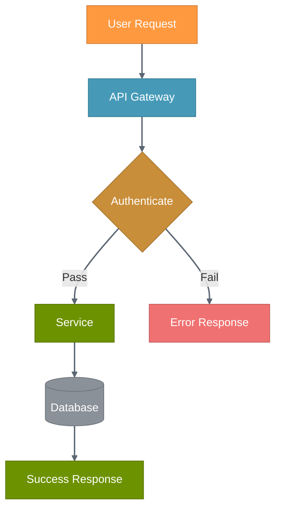
```mermaid
flowchart TD
    user["User Request"] --> api["API Gateway"]
    api --> auth{"Authenticate"}
    auth -->|Pass| service["Service"]
    auth -->|Fail| error["Error Response"]
    service --> db[("Database")]
    db --> response["Success Response"]

    classDef primary fill:#FF9940,stroke:#cc7a33,color:#ffffff
    classDef secondary fill:#8a9199,stroke:#6e747a,color:#ffffff
    classDef success fill:#6d9200,stroke:#577400,color:#ffffff
    classDef warning fill:#c98e3a,stroke:#a07230,color:#ffffff
    classDef danger fill:#f07171,stroke:#c05a5a,color:#ffffff
    classDef info fill:#469ab8,stroke:#387b93,color:#ffffff

    linkStyle default stroke:#5C6773,stroke-width:2px

    class user primary
    class api info
    class auth warning
    class service success
    class error danger
    class db secondary
    class response success
```

---

### 2. Catppuccin Latte

**Classification:** Light
**Source:** [github.com/catppuccin](https://github.com/catppuccin) (MIT)

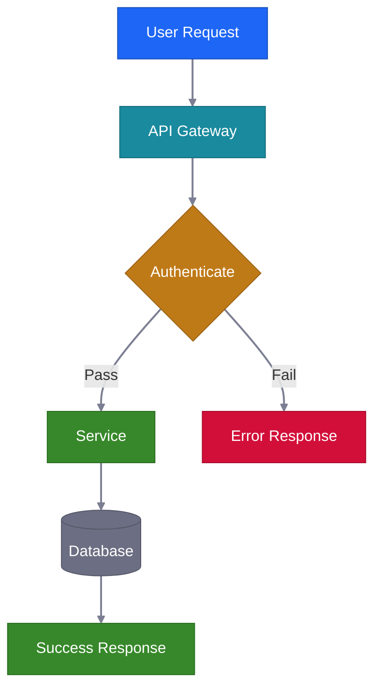
```mermaid
flowchart TD
    user["User Request"] --> api["API Gateway"]
    api --> auth{"Authenticate"}
    auth -->|Pass| service["Service"]
    auth -->|Fail| error["Error Response"]
    service --> db[("Database")]
    db --> response["Success Response"]

    classDef primary fill:#1e66f5,stroke:#184fb8,color:#ffffff
    classDef secondary fill:#6c6f83,stroke:#565869,color:#ffffff
    classDef success fill:#37882a,stroke:#2c6d22,color:#ffffff
    classDef warning fill:#bf7a18,stroke:#996214,color:#ffffff
    classDef danger fill:#d20f39,stroke:#a80c2e,color:#ffffff
    classDef info fill:#1a8a9e,stroke:#156e7e,color:#ffffff

    linkStyle default stroke:#7c7f93,stroke-width:2px

    class user primary
    class api info
    class auth warning
    class service success
    class error danger
    class db secondary
    class response success
```

---

### 3. Everforest Light

**Classification:** Light
**Source:** [github.com/sainnhe/everforest](https://github.com/sainnhe/everforest) (MIT)

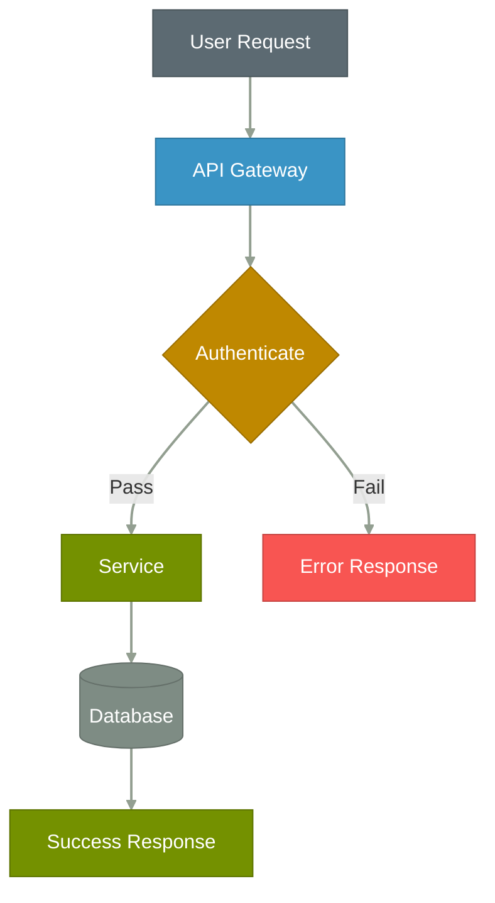
```mermaid
flowchart TD
    user["User Request"] --> api["API Gateway"]
    api --> auth{"Authenticate"}
    auth -->|Pass| service["Service"]
    auth -->|Fail| error["Error Response"]
    service --> db[("Database")]
    db --> response["Success Response"]

    classDef primary fill:#5c6a72,stroke:#49555b,color:#ffffff
    classDef secondary fill:#7e8c84,stroke:#65706a,color:#ffffff
    classDef success fill:#749100,stroke:#5d7400,color:#ffffff
    classDef warning fill:#bf8800,stroke:#996d00,color:#ffffff
    classDef danger fill:#f85552,stroke:#c64442,color:#ffffff
    classDef info fill:#3a94c5,stroke:#2e769e,color:#ffffff

    linkStyle default stroke:#939f91,stroke-width:2px

    class user primary
    class api info
    class auth warning
    class service success
    class error danger
    class db secondary
    class response success
```

---

### 4. Gruvbox Light

**Classification:** Light
**Source:** [github.com/morhetz/gruvbox](https://github.com/morhetz/gruvbox) (MIT)

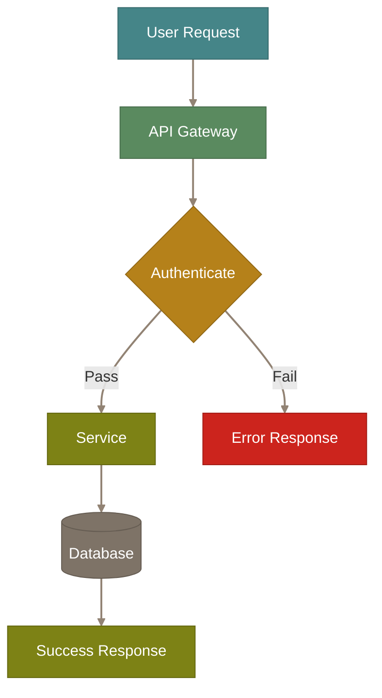
```mermaid
flowchart TD
    user["User Request"] --> api["API Gateway"]
    api --> auth{"Authenticate"}
    auth -->|Pass| service["Service"]
    auth -->|Fail| error["Error Response"]
    service --> db[("Database")]
    db --> response["Success Response"]

    classDef primary fill:#458588,stroke:#376b6d,color:#ffffff
    classDef secondary fill:#7e7367,stroke:#655c52,color:#ffffff
    classDef success fill:#7d8215,stroke:#646811,color:#ffffff
    classDef warning fill:#b5811a,stroke:#916715,color:#ffffff
    classDef danger fill:#cc241d,stroke:#a31d17,color:#ffffff
    classDef info fill:#5a8a5f,stroke:#486e4c,color:#ffffff

    linkStyle default stroke:#928374,stroke-width:2px

    class user primary
    class api info
    class auth warning
    class service success
    class error danger
    class db secondary
    class response success
```

---

### 5. Rose Pine Dawn

**Classification:** Light
**Source:** [github.com/rose-pine](https://github.com/rose-pine) (MIT)

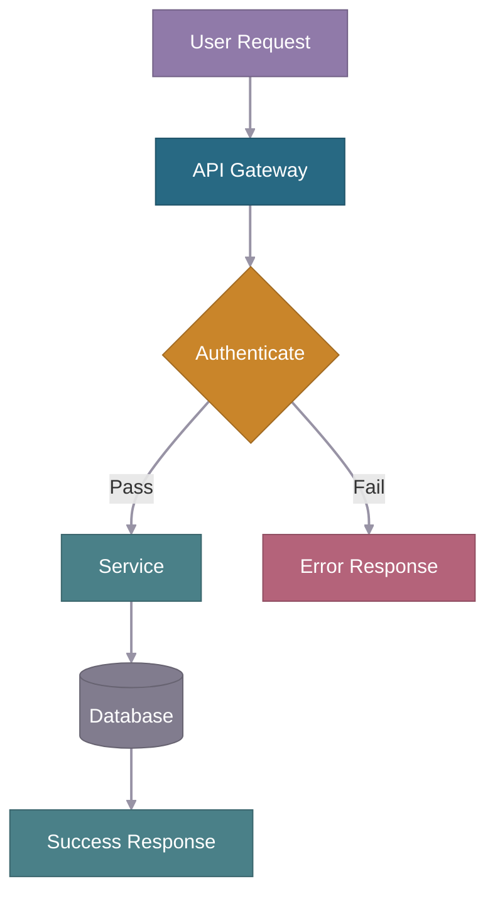
```mermaid
flowchart TD
    user["User Request"] --> api["API Gateway"]
    api --> auth{"Authenticate"}
    auth -->|Pass| service["Service"]
    auth -->|Fail| error["Error Response"]
    service --> db[("Database")]
    db --> response["Success Response"]

    classDef primary fill:#907aa9,stroke:#736287,color:#ffffff
    classDef secondary fill:#817c8e,stroke:#676371,color:#ffffff
    classDef success fill:#4a8088,stroke:#3b666d,color:#ffffff
    classDef warning fill:#c9852a,stroke:#a16a22,color:#ffffff
    classDef danger fill:#b4637a,stroke:#904f62,color:#ffffff
    classDef info fill:#286983,stroke:#205469,color:#ffffff

    linkStyle default stroke:#9893a5,stroke-width:2px

    class user primary
    class api info
    class auth warning
    class service success
    class error danger
    class db secondary
    class response success
```

---

### 6. Solarized Light

**Classification:** Light
**Source:** [github.com/altercation/solarized](https://github.com/altercation/solarized) (MIT)

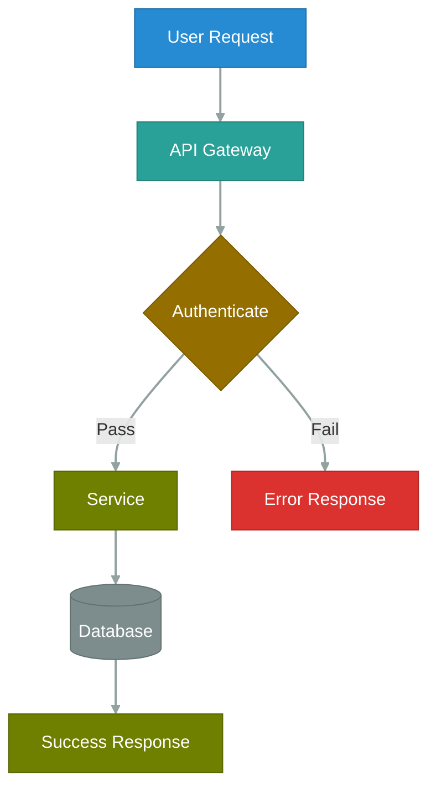
```mermaid
flowchart TD
    user["User Request"] --> api["API Gateway"]
    api --> auth{"Authenticate"}
    auth -->|Pass| service["Service"]
    auth -->|Fail| error["Error Response"]
    service --> db[("Database")]
    db --> response["Success Response"]

    classDef primary fill:#268bd2,stroke:#1e6fa8,color:#ffffff
    classDef secondary fill:#7d8d8d,stroke:#647171,color:#ffffff
    classDef success fill:#6f7f00,stroke:#596600,color:#ffffff
    classDef warning fill:#946f00,stroke:#765900,color:#ffffff
    classDef danger fill:#dc322f,stroke:#b02826,color:#ffffff
    classDef info fill:#2aa198,stroke:#22817a,color:#ffffff

    linkStyle default stroke:#93a1a1,stroke-width:2px

    class user primary
    class api info
    class auth warning
    class service success
    class error danger
    class db secondary
    class response success
```

---

### 7. Tokyo Night Light

**Classification:** Light
**Source:** [github.com/enkia/tokyo-night-vscode-theme](https://github.com/enkia/tokyo-night-vscode-theme) (MIT)

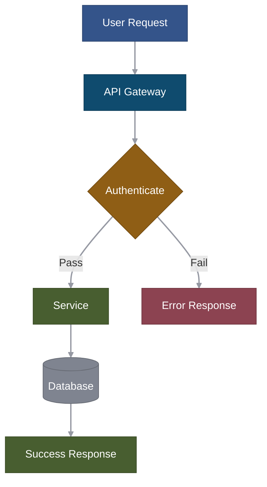
```mermaid
flowchart TD
    user["User Request"] --> api["API Gateway"]
    api --> auth{"Authenticate"}
    auth -->|Pass| service["Service"]
    auth -->|Fail| error["Error Response"]
    service --> db[("Database")]
    db --> response["Success Response"]

    classDef primary fill:#34548a,stroke:#2a436e,color:#ffffff
    classDef secondary fill:#7f8490,stroke:#666a73,color:#ffffff
    classDef success fill:#485e30,stroke:#3a4b26,color:#ffffff
    classDef warning fill:#8f5e15,stroke:#724b11,color:#ffffff
    classDef danger fill:#8c4351,stroke:#703641,color:#ffffff
    classDef info fill:#0f4b6e,stroke:#0c3c58,color:#ffffff

    linkStyle default stroke:#9699a3,stroke-width:2px

    class user primary
    class api info
    class auth warning
    class service success
    class error danger
    class db secondary
    class response success
```

---

## Dark Themes

---

### 8. Ayu Dark

**Classification:** Dark
**Source:** [github.com/ayu-theme](https://github.com/ayu-theme) (MIT)

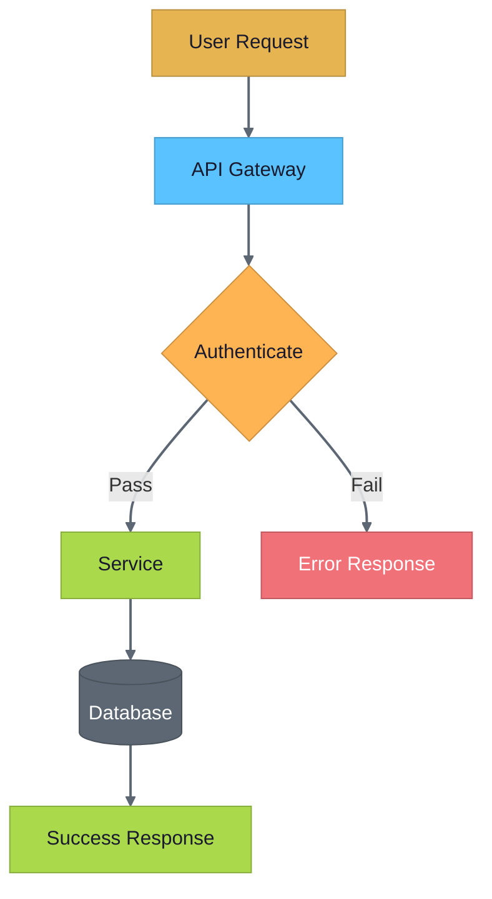
```mermaid
flowchart TD
    user["User Request"] --> api["API Gateway"]
    api --> auth{"Authenticate"}
    auth -->|Pass| service["Service"]
    auth -->|Fail| error["Error Response"]
    service --> db[("Database")]
    db --> response["Success Response"]

    classDef primary fill:#E6B450,stroke:#b89040,color:#1a1a2e
    classDef secondary fill:#5C6773,stroke:#4a525c,color:#ffffff
    classDef success fill:#AAD94C,stroke:#88ae3d,color:#1a1a2e
    classDef warning fill:#FFB454,stroke:#cc9043,color:#1a1a2e
    classDef danger fill:#F07178,stroke:#c05a60,color:#ffffff
    classDef info fill:#59C2FF,stroke:#479bcc,color:#1a1a2e

    linkStyle default stroke:#5C6773,stroke-width:2px

    class user primary
    class api info
    class auth warning
    class service success
    class error danger
    class db secondary
    class response success
```

---

### 9. Ayu Mirage

**Classification:** Dark
**Source:** [github.com/ayu-theme](https://github.com/ayu-theme) (MIT)

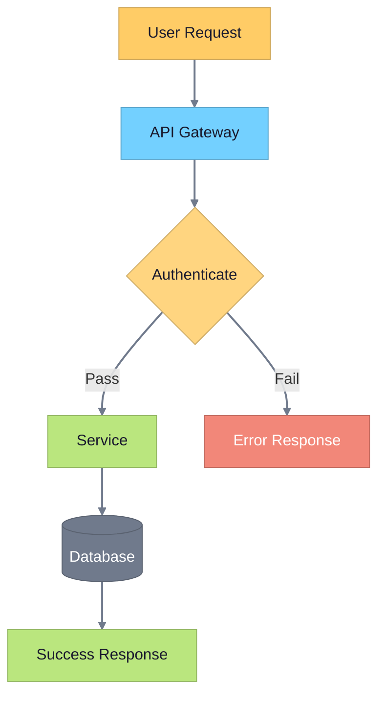
```mermaid
flowchart TD
    user["User Request"] --> api["API Gateway"]
    api --> auth{"Authenticate"}
    auth -->|Pass| service["Service"]
    auth -->|Fail| error["Error Response"]
    service --> db[("Database")]
    db --> response["Success Response"]

    classDef primary fill:#FFCC66,stroke:#cca352,color:#1a1a2e
    classDef secondary fill:#707A8C,stroke:#5a6270,color:#ffffff
    classDef success fill:#BAE67E,stroke:#95b865,color:#1a1a2e
    classDef warning fill:#FFD580,stroke:#ccaa66,color:#1a1a2e
    classDef danger fill:#F28779,stroke:#c26c61,color:#ffffff
    classDef info fill:#73D0FF,stroke:#5ca6cc,color:#1a1a2e

    linkStyle default stroke:#707A8C,stroke-width:2px

    class user primary
    class api info
    class auth warning
    class service success
    class error danger
    class db secondary
    class response success
```

---

### 10. Catppuccin Mocha

**Classification:** Dark
**Source:** [github.com/catppuccin](https://github.com/catppuccin) (MIT)

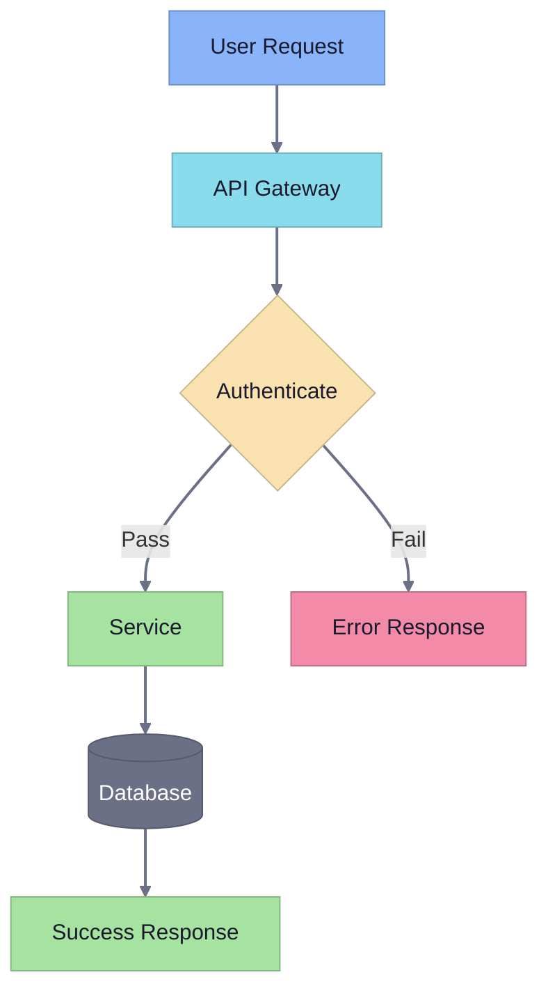
```mermaid
flowchart TD
    user["User Request"] --> api["API Gateway"]
    api --> auth{"Authenticate"}
    auth -->|Pass| service["Service"]
    auth -->|Fail| error["Error Response"]
    service --> db[("Database")]
    db --> response["Success Response"]

    classDef primary fill:#89b4fa,stroke:#6e90c8,color:#1a1a2e
    classDef secondary fill:#6c7086,stroke:#565a6b,color:#ffffff
    classDef success fill:#a6e3a1,stroke:#85b681,color:#1a1a2e
    classDef warning fill:#f9e2af,stroke:#c7b58c,color:#1a1a2e
    classDef danger fill:#f38ba8,stroke:#c26f86,color:#1a1a2e
    classDef info fill:#89dceb,stroke:#6eb0bc,color:#1a1a2e

    linkStyle default stroke:#6c7086,stroke-width:2px

    class user primary
    class api info
    class auth warning
    class service success
    class error danger
    class db secondary
    class response success
```

---

### 11. Dracula

**Classification:** Dark
**Source:** [github.com/dracula/dracula-theme](https://github.com/dracula/dracula-theme) (MIT)

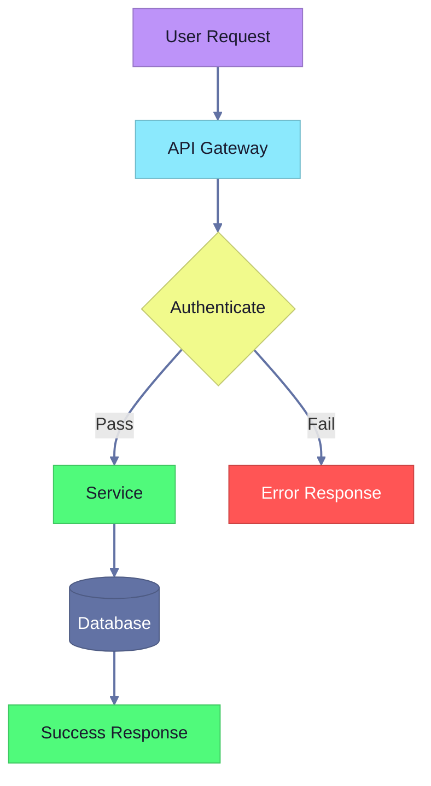
```mermaid
flowchart TD
    user["User Request"] --> api["API Gateway"]
    api --> auth{"Authenticate"}
    auth -->|Pass| service["Service"]
    auth -->|Fail| error["Error Response"]
    service --> db[("Database")]
    db --> response["Success Response"]

    classDef primary fill:#bd93f9,stroke:#9776c7,color:#1a1a2e
    classDef secondary fill:#6272a4,stroke:#4e5b83,color:#ffffff
    classDef success fill:#50fa7b,stroke:#40c862,color:#1a1a2e
    classDef warning fill:#f1fa8c,stroke:#c1c870,color:#1a1a2e
    classDef danger fill:#ff5555,stroke:#cc4444,color:#ffffff
    classDef info fill:#8be9fd,stroke:#6fbaca,color:#1a1a2e

    linkStyle default stroke:#6272a4,stroke-width:2px

    class user primary
    class api info
    class auth warning
    class service success
    class error danger
    class db secondary
    class response success
```

---

### 12. Everforest Dark

**Classification:** Dark
**Source:** [github.com/sainnhe/everforest](https://github.com/sainnhe/everforest) (MIT)

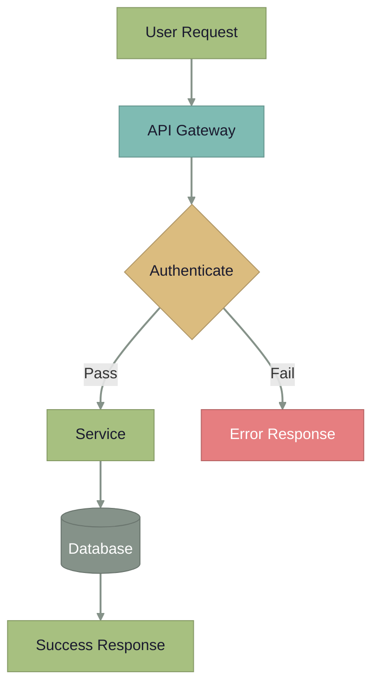
```mermaid
flowchart TD
    user["User Request"] --> api["API Gateway"]
    api --> auth{"Authenticate"}
    auth -->|Pass| service["Service"]
    auth -->|Fail| error["Error Response"]
    service --> db[("Database")]
    db --> response["Success Response"]

    classDef primary fill:#a7c080,stroke:#869a66,color:#1a1a2e
    classDef secondary fill:#859289,stroke:#6a756e,color:#ffffff
    classDef success fill:#a7c080,stroke:#869a66,color:#1a1a2e
    classDef warning fill:#dbbc7f,stroke:#af9666,color:#1a1a2e
    classDef danger fill:#e67e80,stroke:#b86566,color:#ffffff
    classDef info fill:#7fbbb3,stroke:#66968f,color:#1a1a2e

    linkStyle default stroke:#859289,stroke-width:2px

    class user primary
    class api info
    class auth warning
    class service success
    class error danger
    class db secondary
    class response success
```

---

### 13. Gruvbox Dark

**Classification:** Dark
**Source:** [github.com/morhetz/gruvbox](https://github.com/morhetz/gruvbox) (MIT)

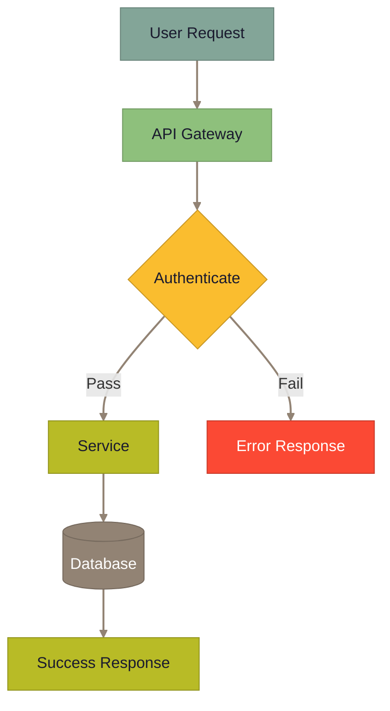
```mermaid
flowchart TD
    user["User Request"] --> api["API Gateway"]
    api --> auth{"Authenticate"}
    auth -->|Pass| service["Service"]
    auth -->|Fail| error["Error Response"]
    service --> db[("Database")]
    db --> response["Success Response"]

    classDef primary fill:#83a598,stroke:#69847a,color:#1a1a2e
    classDef secondary fill:#928374,stroke:#75695d,color:#ffffff
    classDef success fill:#b8bb26,stroke:#93961e,color:#1a1a2e
    classDef warning fill:#fabd2f,stroke:#c89726,color:#1a1a2e
    classDef danger fill:#fb4934,stroke:#c93a2a,color:#ffffff
    classDef info fill:#8ec07c,stroke:#729a63,color:#1a1a2e

    linkStyle default stroke:#928374,stroke-width:2px

    class user primary
    class api info
    class auth warning
    class service success
    class error danger
    class db secondary
    class response success
```

---

### 14. Horizon Dark

**Classification:** Dark
**Source:** [github.com/jolaleye/horizon-theme-vscode](https://github.com/jolaleye/horizon-theme-vscode) (MIT)

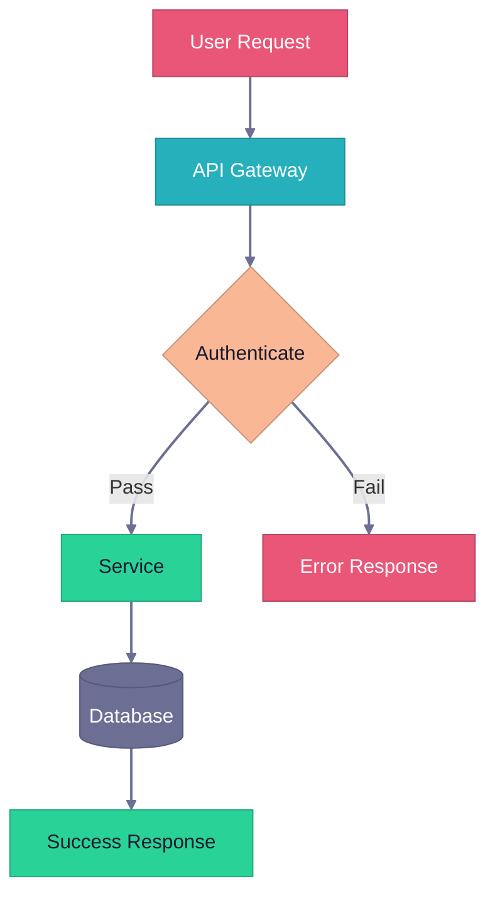
```mermaid
flowchart TD
    user["User Request"] --> api["API Gateway"]
    api --> auth{"Authenticate"}
    auth -->|Pass| service["Service"]
    auth -->|Fail| error["Error Response"]
    service --> db[("Database")]
    db --> response["Success Response"]

    classDef primary fill:#E95678,stroke:#ba4560,color:#ffffff
    classDef secondary fill:#6C6F93,stroke:#565876,color:#ffffff
    classDef success fill:#29D398,stroke:#21a97a,color:#1a1a2e
    classDef warning fill:#FAB795,stroke:#c89277,color:#1a1a2e
    classDef danger fill:#E95678,stroke:#ba4560,color:#ffffff
    classDef info fill:#25B0BC,stroke:#1e8d96,color:#ffffff

    linkStyle default stroke:#6C6F93,stroke-width:2px

    class user primary
    class api info
    class auth warning
    class service success
    class error danger
    class db secondary
    class response success
```

---

### 15. Kanagawa

**Classification:** Dark
**Source:** [github.com/rebelot/kanagawa.nvim](https://github.com/rebelot/kanagawa.nvim) (MIT)

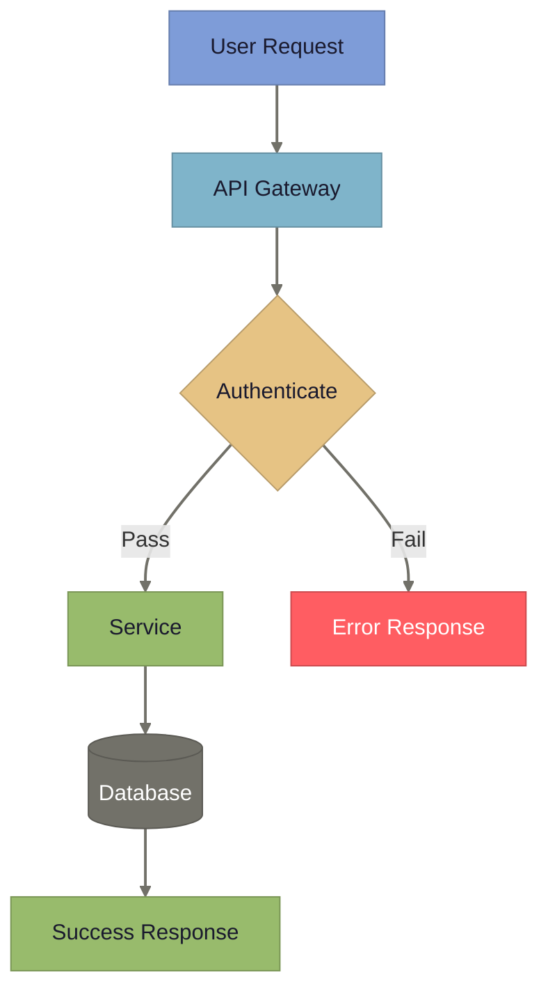
```mermaid
flowchart TD
    user["User Request"] --> api["API Gateway"]
    api --> auth{"Authenticate"}
    auth -->|Pass| service["Service"]
    auth -->|Fail| error["Error Response"]
    service --> db[("Database")]
    db --> response["Success Response"]

    classDef primary fill:#7E9CD8,stroke:#657dad,color:#1a1a2e
    classDef secondary fill:#727169,stroke:#5b5a54,color:#ffffff
    classDef success fill:#98BB6C,stroke:#7a9656,color:#1a1a2e
    classDef warning fill:#E6C384,stroke:#b89c6a,color:#1a1a2e
    classDef danger fill:#FF5D62,stroke:#cc4a4e,color:#ffffff
    classDef info fill:#7FB4CA,stroke:#6690a2,color:#1a1a2e

    linkStyle default stroke:#727169,stroke-width:2px

    class user primary
    class api info
    class auth warning
    class service success
    class error danger
    class db secondary
    class response success
```

---

### 16. Material Dark

**Classification:** Dark
**Source:** [github.com/material-theme](https://github.com/material-theme) (MIT)

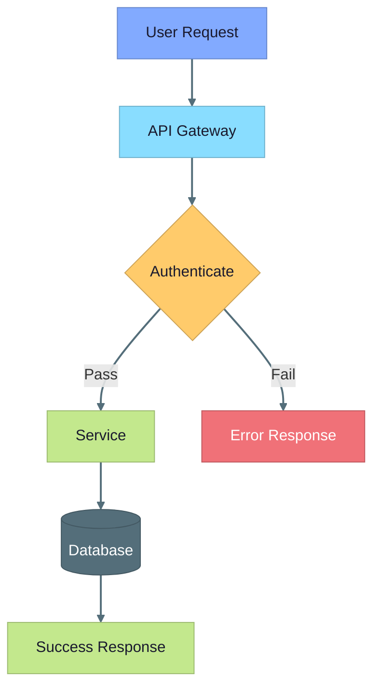
```mermaid
flowchart TD
    user["User Request"] --> api["API Gateway"]
    api --> auth{"Authenticate"}
    auth -->|Pass| service["Service"]
    auth -->|Fail| error["Error Response"]
    service --> db[("Database")]
    db --> response["Success Response"]

    classDef primary fill:#82AAFF,stroke:#6888cc,color:#1a1a2e
    classDef secondary fill:#546E7A,stroke:#435862,color:#ffffff
    classDef success fill:#C3E88D,stroke:#9cba71,color:#1a1a2e
    classDef warning fill:#FFCB6B,stroke:#cca256,color:#1a1a2e
    classDef danger fill:#F07178,stroke:#c05a60,color:#ffffff
    classDef info fill:#89DDFF,stroke:#6eb1cc,color:#1a1a2e

    linkStyle default stroke:#546E7A,stroke-width:2px

    class user primary
    class api info
    class auth warning
    class service success
    class error danger
    class db secondary
    class response success
```

---

### 17. Monokai Pro

**Classification:** Dark
**Source:** [monokai.pro](https://monokai.pro) (MIT)

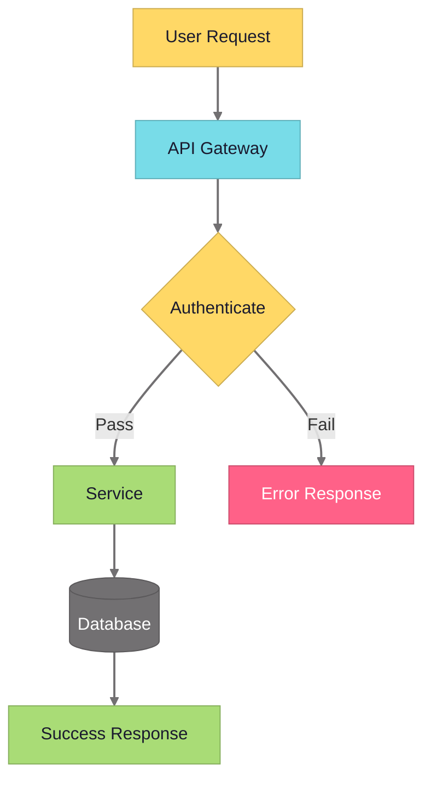
```mermaid
flowchart TD
    user["User Request"] --> api["API Gateway"]
    api --> auth{"Authenticate"}
    auth -->|Pass| service["Service"]
    auth -->|Fail| error["Error Response"]
    service --> db[("Database")]
    db --> response["Success Response"]

    classDef primary fill:#FFD866,stroke:#ccad52,color:#1a1a2e
    classDef secondary fill:#727072,stroke:#5b595b,color:#ffffff
    classDef success fill:#A9DC76,stroke:#87b05e,color:#1a1a2e
    classDef warning fill:#FFD866,stroke:#ccad52,color:#1a1a2e
    classDef danger fill:#FF6188,stroke:#cc4e6d,color:#ffffff
    classDef info fill:#78DCE8,stroke:#60b0ba,color:#1a1a2e

    linkStyle default stroke:#727072,stroke-width:2px

    class user primary
    class api info
    class auth warning
    class service success
    class error danger
    class db secondary
    class response success
```

---

### 18. Nord

**Classification:** Dark
**Source:** [github.com/nordtheme](https://github.com/nordtheme) (MIT)

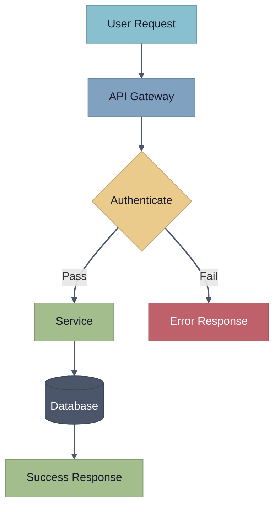
```mermaid
flowchart TD
    user["User Request"] --> api["API Gateway"]
    api --> auth{"Authenticate"}
    auth -->|Pass| service["Service"]
    auth -->|Fail| error["Error Response"]
    service --> db[("Database")]
    db --> response["Success Response"]

    classDef primary fill:#88C0D0,stroke:#6d9aa6,color:#1a1a2e
    classDef secondary fill:#4C566A,stroke:#3d4555,color:#ffffff
    classDef success fill:#A3BE8C,stroke:#829870,color:#1a1a2e
    classDef warning fill:#EBCB8B,stroke:#bca26f,color:#1a1a2e
    classDef danger fill:#BF616A,stroke:#994e55,color:#ffffff
    classDef info fill:#81A1C1,stroke:#67819a,color:#1a1a2e

    linkStyle default stroke:#4C566A,stroke-width:2px

    class user primary
    class api info
    class auth warning
    class service success
    class error danger
    class db secondary
    class response success
```

---

### 19. One Dark

**Classification:** Dark
**Source:** [github.com/Binaryify/OneDark-Pro](https://github.com/Binaryify/OneDark-Pro) (MIT)

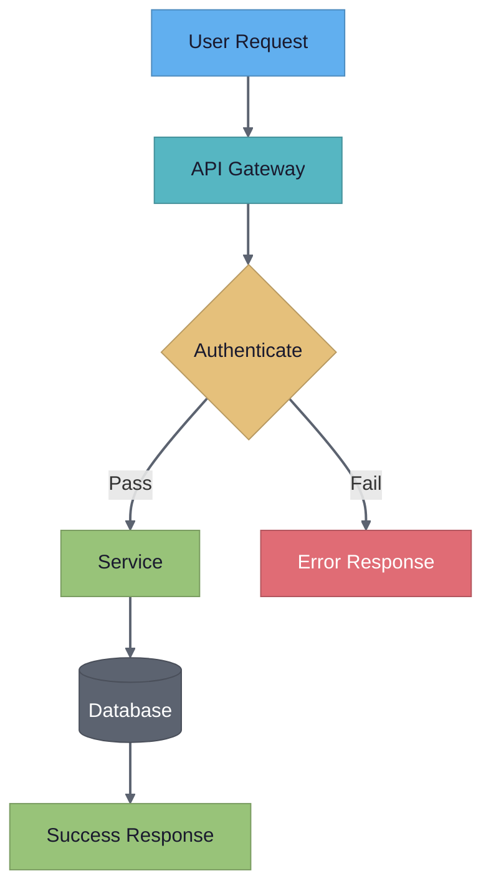
```mermaid
flowchart TD
    user["User Request"] --> api["API Gateway"]
    api --> auth{"Authenticate"}
    auth -->|Pass| service["Service"]
    auth -->|Fail| error["Error Response"]
    service --> db[("Database")]
    db --> response["Success Response"]

    classDef primary fill:#61AFEF,stroke:#4e8cbf,color:#1a1a2e
    classDef secondary fill:#5C6370,stroke:#4a4f5a,color:#ffffff
    classDef success fill:#98C379,stroke:#7a9c61,color:#1a1a2e
    classDef warning fill:#E5C07B,stroke:#b89a62,color:#1a1a2e
    classDef danger fill:#E06C75,stroke:#b3565e,color:#ffffff
    classDef info fill:#56B6C2,stroke:#45929b,color:#1a1a2e

    linkStyle default stroke:#5C6370,stroke-width:2px

    class user primary
    class api info
    class auth warning
    class service success
    class error danger
    class db secondary
    class response success
```

---

### 20. Palenight

**Classification:** Dark
**Source:** [github.com/material-theme](https://github.com/material-theme) (MIT)

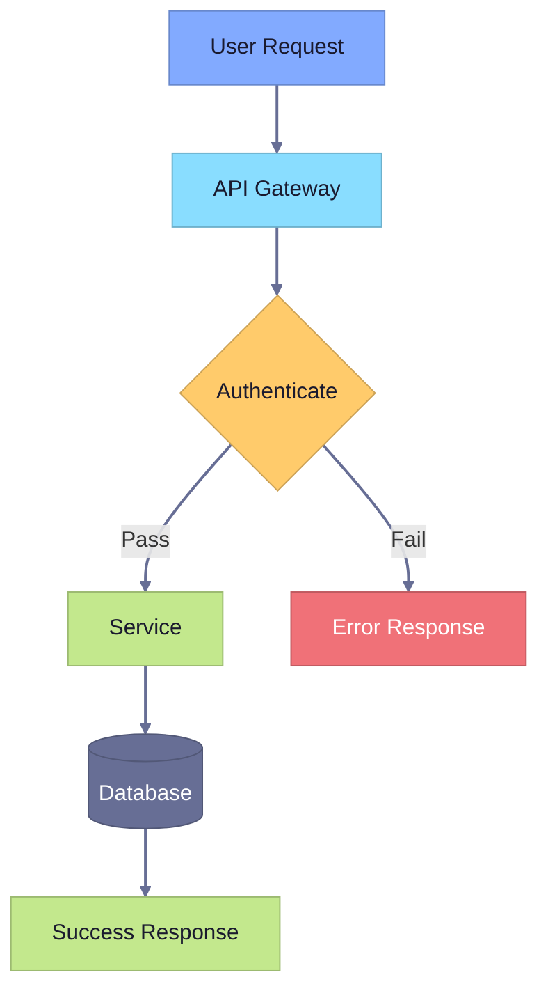
```mermaid
flowchart TD
    user["User Request"] --> api["API Gateway"]
    api --> auth{"Authenticate"}
    auth -->|Pass| service["Service"]
    auth -->|Fail| error["Error Response"]
    service --> db[("Database")]
    db --> response["Success Response"]

    classDef primary fill:#82AAFF,stroke:#6888cc,color:#1a1a2e
    classDef secondary fill:#676E95,stroke:#525877,color:#ffffff
    classDef success fill:#C3E88D,stroke:#9cba71,color:#1a1a2e
    classDef warning fill:#FFCB6B,stroke:#cca256,color:#1a1a2e
    classDef danger fill:#F07178,stroke:#c05a60,color:#ffffff
    classDef info fill:#89DDFF,stroke:#6eb1cc,color:#1a1a2e

    linkStyle default stroke:#676E95,stroke-width:2px

    class user primary
    class api info
    class auth warning
    class service success
    class error danger
    class db secondary
    class response success
```

---

### 21. Rose Pine

**Classification:** Dark
**Source:** [github.com/rose-pine](https://github.com/rose-pine) (MIT)

```mermaid
flowchart TD
    user["User Request"] --> api["API Gateway"]
    api --> auth{"Authenticate"}
    auth -->|Pass| service["Service"]
    auth -->|Fail| error["Error Response"]
    service --> db[("Database")]
    db --> response["Success Response"]

    classDef primary fill:#c4a7e7,stroke:#9d86b9,color:#1a1a2e
    classDef secondary fill:#6e6a86,stroke:#58556b,color:#ffffff
    classDef success fill:#9ccfd8,stroke:#7da6ad,color:#1a1a2e
    classDef warning fill:#f6c177,stroke:#c59a5f,color:#1a1a2e
    classDef danger fill:#eb6f92,stroke:#bc5975,color:#ffffff
    classDef info fill:#31748f,stroke:#275d72,color:#ffffff

    linkStyle default stroke:#6e6a86,stroke-width:2px

    class user primary
    class api info
    class auth warning
    class service success
    class error danger
    class db secondary
    class response success
```

---

### 22. Synthwave '84

**Classification:** Dark
**Source:** [github.com/robb0wen/synthwave-vscode](https://github.com/robb0wen/synthwave-vscode) (MIT)

```mermaid
flowchart TD
    user["User Request"] --> api["API Gateway"]
    api --> auth{"Authenticate"}
    auth -->|Pass| service["Service"]
    auth -->|Fail| error["Error Response"]
    service --> db[("Database")]
    db --> response["Success Response"]

    classDef primary fill:#FF7EDB,stroke:#cc65af,color:#1a1a2e
    classDef secondary fill:#495495,stroke:#3a4377,color:#ffffff
    classDef success fill:#72F1B8,stroke:#5bc193,color:#1a1a2e
    classDef warning fill:#FEDE5D,stroke:#cbb24a,color:#1a1a2e
    classDef danger fill:#FE4450,stroke:#cb3640,color:#ffffff
    classDef info fill:#36F9F6,stroke:#2bc7c5,color:#1a1a2e

    linkStyle default stroke:#495495,stroke-width:2px

    class user primary
    class api info
    class auth warning
    class service success
    class error danger
    class db secondary
    class response success
```

---

### 23. Tokyo Night

**Classification:** Dark
**Source:** [github.com/enkia/tokyo-night-vscode-theme](https://github.com/enkia/tokyo-night-vscode-theme) (MIT)

```mermaid
flowchart TD
    user["User Request"] --> api["API Gateway"]
    api --> auth{"Authenticate"}
    auth -->|Pass| service["Service"]
    auth -->|Fail| error["Error Response"]
    service --> db[("Database")]
    db --> response["Success Response"]

    classDef primary fill:#7AA2F7,stroke:#6282c6,color:#1a1a2e
    classDef secondary fill:#565F89,stroke:#454c6e,color:#ffffff
    classDef success fill:#9ECE6A,stroke:#7ea555,color:#1a1a2e
    classDef warning fill:#E0AF68,stroke:#b38c53,color:#1a1a2e
    classDef danger fill:#F7768E,stroke:#c65e72,color:#ffffff
    classDef info fill:#7DCFFF,stroke:#64a6cc,color:#1a1a2e

    linkStyle default stroke:#565F89,stroke-width:2px

    class user primary
    class api info
    class auth warning
    class service success
    class error danger
    class db secondary
    class response success
```

---

### 24. Tokyo Night Storm

**Classification:** Dark
**Source:** [github.com/enkia/tokyo-night-vscode-theme](https://github.com/enkia/tokyo-night-vscode-theme) (MIT)

```mermaid
flowchart TD
    user["User Request"] --> api["API Gateway"]
    api --> auth{"Authenticate"}
    auth -->|Pass| service["Service"]
    auth -->|Fail| error["Error Response"]
    service --> db[("Database")]
    db --> response["Success Response"]

    classDef primary fill:#7AA2F7,stroke:#6282c6,color:#1a1a2e
    classDef secondary fill:#565F89,stroke:#454c6e,color:#ffffff
    classDef success fill:#9ECE6A,stroke:#7ea555,color:#1a1a2e
    classDef warning fill:#E0AF68,stroke:#b38c53,color:#1a1a2e
    classDef danger fill:#F7768E,stroke:#c65e72,color:#ffffff
    classDef info fill:#7DCFFF,stroke:#64a6cc,color:#1a1a2e

    linkStyle default stroke:#565F89,stroke-width:2px

    class user primary
    class api info
    class auth warning
    class service success
    class error danger
    class db secondary
    class response success
```

---

## GitHub Compatibility Notes

All themes in this reference use **explicit text colors** (`color:#ffffff` or `color:#1a1a2e`)
in every `classDef` declaration. This ensures node text remains readable regardless of
whether the viewer is using GitHub's light or dark mode.

GitHub renders Mermaid diagrams using its own background color (`#ffffff` in light mode,
`#0d1117` in dark mode). Because we cannot control this background, all fills are chosen
in the medium-to-dark range so that the node shapes are visible against both backgrounds.

**Light theme fills** are intentionally darkened from their original editor accent colors.
In the source editors, these colors appear on a light background. Since Mermaid nodes use
the color as a fill (not a background), we shift them darker to maintain contrast.

**Dark theme fills** use the original accent colors directly, as they are already designed
to be visible on dark surfaces.

### Quick Reference: Copy a Theme

To use any theme, copy just the `classDef` and `linkStyle` lines into your diagram:

```mermaid
flowchart TD
    A --> B --> C

    %% Paste classDef lines here
    classDef primary fill:#7AA2F7,stroke:#6282c6,color:#1a1a2e
    classDef success fill:#9ECE6A,stroke:#7ea555,color:#1a1a2e

    class A primary
    class C success
```
