# Mermaid Color Themes Reference

Themes are a color menu. Pick one that matches your project's vibe, then copy only the
`classDef` lines you actually need. Most diagrams use 3-5 classes, not all 11.

## Semantic Classes

| Class | Purpose |
|-------|---------|
| `primary` | Main action, entry points |
| `secondary` | Supporting, passive |
| `success` | Happy path, completion |
| `warning` | Decisions, conditional |
| `danger` | Errors, failures |
| `info` | Informational, metadata |
| `accent` | Highlights, CTAs |
| `warm` | Warm emphasis |
| `muted` | De-emphasized, infrastructure |
| `surface` | Background containers |
| `external` | Outside-the-system (dashed border) |

## How to Use

Copy only what you need from a theme. A typical diagram uses 4 classes:

```
classDef primary fill:#...,stroke:#...,stroke-width:2px,color:#...
classDef muted fill:#...,stroke:#...,stroke-width:2px,color:#...
classDef success fill:#...,stroke:#...,stroke-width:2px,color:#...
classDef danger fill:#...,stroke:#...,stroke-width:2px,color:#...
linkStyle default stroke:#...,stroke-width:2px
```

Then apply: `class api,svc primary` etc.

---

## Light Themes

---

### 1. Ayu Light

**Mode:** Light | **Source:** [github.com/ayu-theme](https://github.com/ayu-theme) (MIT)

**Subgraph:** `fill:#fafafa,stroke:#5C6773,stroke-width:2px,color:#5C6773`
**Edges:** `stroke:#8a9199,stroke-width:2px`

| Class | Definition |
|-------|-----------|
| primary | `fill:#FF9940,stroke:#5C6773,stroke-width:2px,color:#ffffff` |
| secondary | `fill:#8a9199,stroke:#5C6773,stroke-width:2px,color:#ffffff` |
| success | `fill:#6d9200,stroke:#5C6773,stroke-width:2px,color:#ffffff` |
| warning | `fill:#c98e3a,stroke:#5C6773,stroke-width:2px,color:#ffffff` |
| danger | `fill:#f07171,stroke:#5C6773,stroke-width:2px,color:#ffffff` |
| info | `fill:#469ab8,stroke:#5C6773,stroke-width:2px,color:#ffffff` |
| accent | `fill:#FF9940,stroke:#5C6773,stroke-width:2px,color:#ffffff` |
| warm | `fill:#c98e3a,stroke:#5C6773,stroke-width:2px,color:#ffffff` |
| muted | `fill:#8a9199,stroke:#5C6773,stroke-width:2px,color:#ffffff` |
| surface | `fill:#f0ede6,stroke:#5C6773,stroke-width:2px,color:#5C6773` |
| external | `fill:#8a9199,stroke:#5C6773,stroke-width:2px,color:#ffffff,stroke-dasharray:5` |

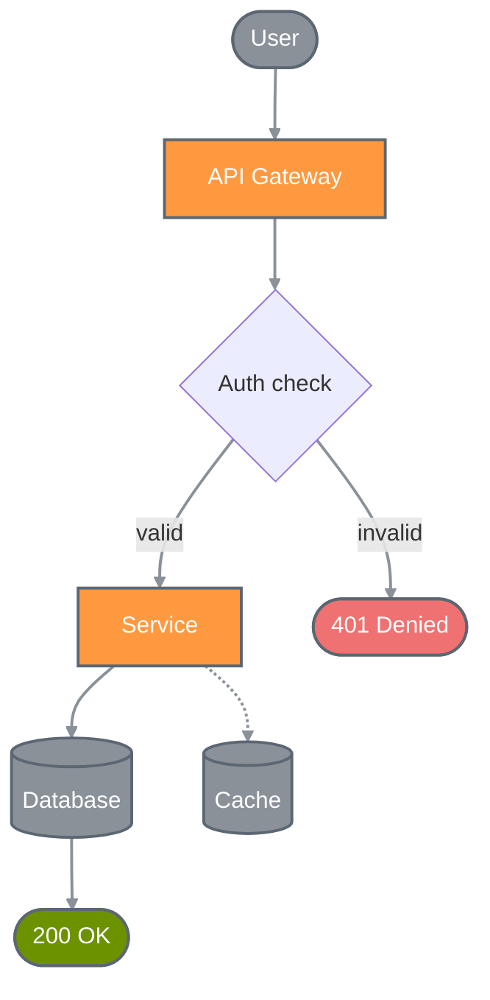

---

### 2. Catppuccin Latte

**Mode:** Light | **Source:** [github.com/catppuccin](https://github.com/catppuccin) (MIT)

**Subgraph:** `fill:#eff1f5,stroke:#7c7f93,stroke-width:2px,color:#4c4f69`
**Edges:** `stroke:#8c8fa1,stroke-width:2px`

| Class | Definition |
|-------|-----------|
| primary | `fill:#1e66f5,stroke:#7c7f93,stroke-width:2px,color:#ffffff` |
| secondary | `fill:#6c6f83,stroke:#7c7f93,stroke-width:2px,color:#ffffff` |
| success | `fill:#37882a,stroke:#7c7f93,stroke-width:2px,color:#ffffff` |
| warning | `fill:#bf7a18,stroke:#7c7f93,stroke-width:2px,color:#ffffff` |
| danger | `fill:#d20f39,stroke:#7c7f93,stroke-width:2px,color:#ffffff` |
| info | `fill:#1a8a9e,stroke:#7c7f93,stroke-width:2px,color:#ffffff` |
| accent | `fill:#8839ef,stroke:#7c7f93,stroke-width:2px,color:#ffffff` |
| warm | `fill:#e64553,stroke:#7c7f93,stroke-width:2px,color:#ffffff` |
| muted | `fill:#6c6f83,stroke:#7c7f93,stroke-width:2px,color:#ffffff` |
| surface | `fill:#e6e9ef,stroke:#7c7f93,stroke-width:2px,color:#4c4f69` |
| external | `fill:#6c6f83,stroke:#7c7f93,stroke-width:2px,color:#ffffff,stroke-dasharray:5` |

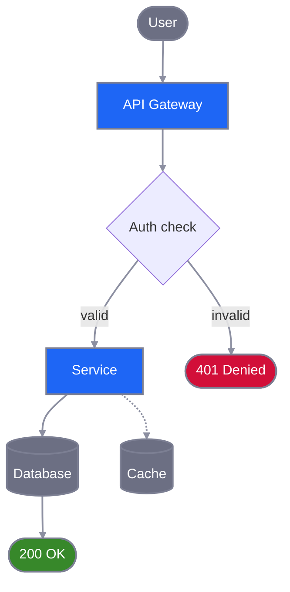

---

### 3. Everforest Light

**Mode:** Light | **Source:** [github.com/sainnhe/everforest](https://github.com/sainnhe/everforest) (MIT)

**Subgraph:** `fill:#f3ead3,stroke:#939f91,stroke-width:2px,color:#5c6a72`
**Edges:** `stroke:#999f93,stroke-width:2px`

| Class | Definition |
|-------|-----------|
| primary | `fill:#5c6a72,stroke:#939f91,stroke-width:2px,color:#ffffff` |
| secondary | `fill:#7e8c84,stroke:#939f91,stroke-width:2px,color:#ffffff` |
| success | `fill:#749100,stroke:#939f91,stroke-width:2px,color:#ffffff` |
| warning | `fill:#bf8800,stroke:#939f91,stroke-width:2px,color:#ffffff` |
| danger | `fill:#f85552,stroke:#939f91,stroke-width:2px,color:#ffffff` |
| info | `fill:#3a94c5,stroke:#939f91,stroke-width:2px,color:#ffffff` |
| accent | `fill:#8da101,stroke:#939f91,stroke-width:2px,color:#ffffff` |
| warm | `fill:#df6933,stroke:#939f91,stroke-width:2px,color:#ffffff` |
| muted | `fill:#7e8c84,stroke:#939f91,stroke-width:2px,color:#ffffff` |
| surface | `fill:#efebd4,stroke:#939f91,stroke-width:2px,color:#5c6a72` |
| external | `fill:#7e8c84,stroke:#939f91,stroke-width:2px,color:#ffffff,stroke-dasharray:5` |

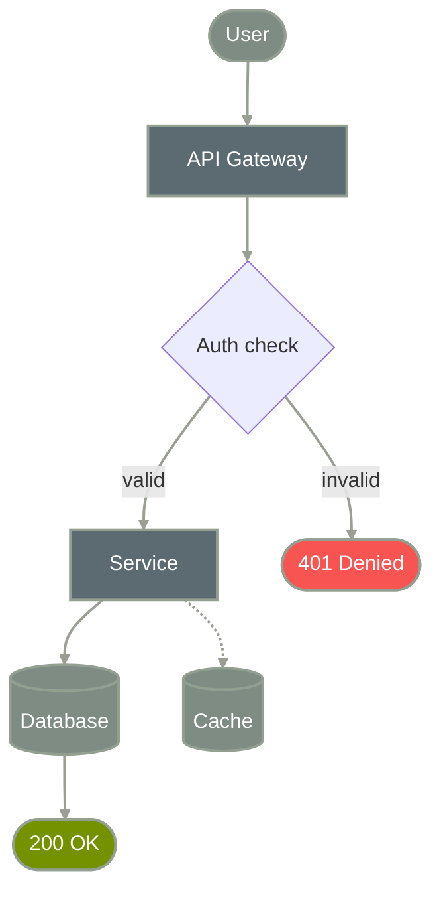

---

### 4. Gruvbox Light

**Mode:** Light | **Source:** [github.com/morhetz/gruvbox](https://github.com/morhetz/gruvbox) (MIT)

**Subgraph:** `fill:#fbf1c7,stroke:#928374,stroke-width:2px,color:#3c3836`
**Edges:** `stroke:#a89984,stroke-width:2px`

| Class | Definition |
|-------|-----------|
| primary | `fill:#458588,stroke:#928374,stroke-width:2px,color:#ffffff` |
| secondary | `fill:#7e7367,stroke:#928374,stroke-width:2px,color:#ffffff` |
| success | `fill:#7d8215,stroke:#928374,stroke-width:2px,color:#ffffff` |
| warning | `fill:#b5811a,stroke:#928374,stroke-width:2px,color:#ffffff` |
| danger | `fill:#cc241d,stroke:#928374,stroke-width:2px,color:#ffffff` |
| info | `fill:#5a8a5f,stroke:#928374,stroke-width:2px,color:#ffffff` |
| accent | `fill:#b16286,stroke:#928374,stroke-width:2px,color:#ffffff` |
| warm | `fill:#d65d0e,stroke:#928374,stroke-width:2px,color:#ffffff` |
| muted | `fill:#7e7367,stroke:#928374,stroke-width:2px,color:#ffffff` |
| surface | `fill:#f2e5bc,stroke:#928374,stroke-width:2px,color:#3c3836` |
| external | `fill:#7e7367,stroke:#928374,stroke-width:2px,color:#ffffff,stroke-dasharray:5` |

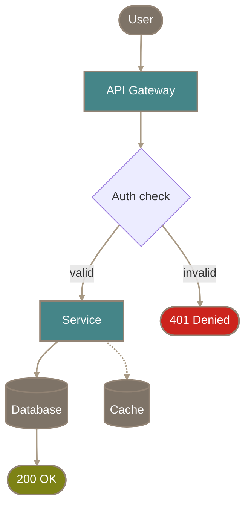

---

### 5. Rose Pine Dawn

**Mode:** Light | **Source:** [github.com/rose-pine](https://github.com/rose-pine) (MIT)

**Subgraph:** `fill:#faf4ed,stroke:#9893a5,stroke-width:2px,color:#575279`
**Edges:** `stroke:#9893a5,stroke-width:2px`

| Class | Definition |
|-------|-----------|
| primary | `fill:#907aa9,stroke:#9893a5,stroke-width:2px,color:#ffffff` |
| secondary | `fill:#817c8e,stroke:#9893a5,stroke-width:2px,color:#ffffff` |
| success | `fill:#4a8088,stroke:#9893a5,stroke-width:2px,color:#ffffff` |
| warning | `fill:#c9852a,stroke:#9893a5,stroke-width:2px,color:#ffffff` |
| danger | `fill:#b4637a,stroke:#9893a5,stroke-width:2px,color:#ffffff` |
| info | `fill:#286983,stroke:#9893a5,stroke-width:2px,color:#ffffff` |
| accent | `fill:#d7827e,stroke:#9893a5,stroke-width:2px,color:#ffffff` |
| warm | `fill:#ea9d34,stroke:#9893a5,stroke-width:2px,color:#ffffff` |
| muted | `fill:#817c8e,stroke:#9893a5,stroke-width:2px,color:#ffffff` |
| surface | `fill:#f2e9e1,stroke:#9893a5,stroke-width:2px,color:#575279` |
| external | `fill:#817c8e,stroke:#9893a5,stroke-width:2px,color:#ffffff,stroke-dasharray:5` |

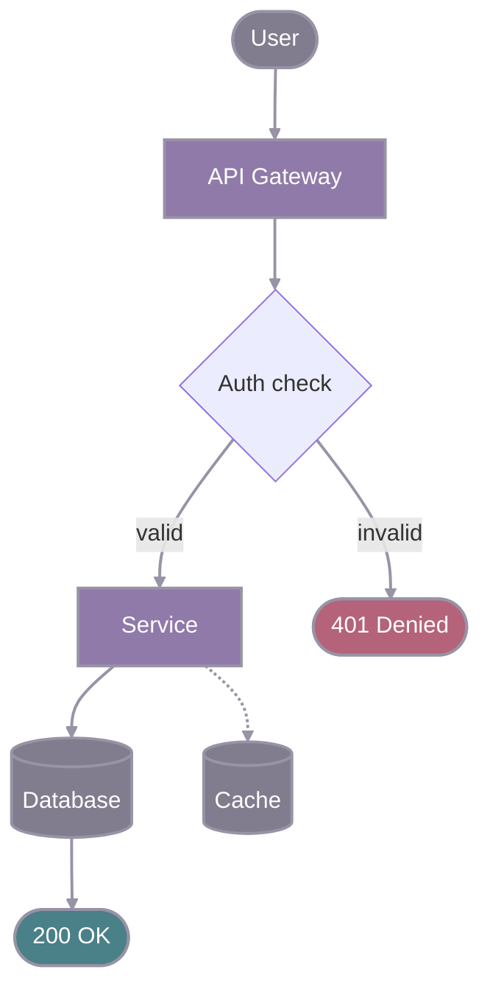

---

### 6. Solarized Light

**Mode:** Light | **Source:** [github.com/altercation/solarized](https://github.com/altercation/solarized) (MIT)

**Subgraph:** `fill:#fdf6e3,stroke:#93a1a1,stroke-width:2px,color:#586e75`
**Edges:** `stroke:#93a1a1,stroke-width:2px`

| Class | Definition |
|-------|-----------|
| primary | `fill:#268bd2,stroke:#93a1a1,stroke-width:2px,color:#ffffff` |
| secondary | `fill:#7d8d8d,stroke:#93a1a1,stroke-width:2px,color:#ffffff` |
| success | `fill:#6f7f00,stroke:#93a1a1,stroke-width:2px,color:#ffffff` |
| warning | `fill:#946f00,stroke:#93a1a1,stroke-width:2px,color:#ffffff` |
| danger | `fill:#dc322f,stroke:#93a1a1,stroke-width:2px,color:#ffffff` |
| info | `fill:#2aa198,stroke:#93a1a1,stroke-width:2px,color:#ffffff` |
| accent | `fill:#6c71c4,stroke:#93a1a1,stroke-width:2px,color:#ffffff` |
| warm | `fill:#cb4b16,stroke:#93a1a1,stroke-width:2px,color:#ffffff` |
| muted | `fill:#7d8d8d,stroke:#93a1a1,stroke-width:2px,color:#ffffff` |
| surface | `fill:#eee8d5,stroke:#93a1a1,stroke-width:2px,color:#586e75` |
| external | `fill:#7d8d8d,stroke:#93a1a1,stroke-width:2px,color:#ffffff,stroke-dasharray:5` |

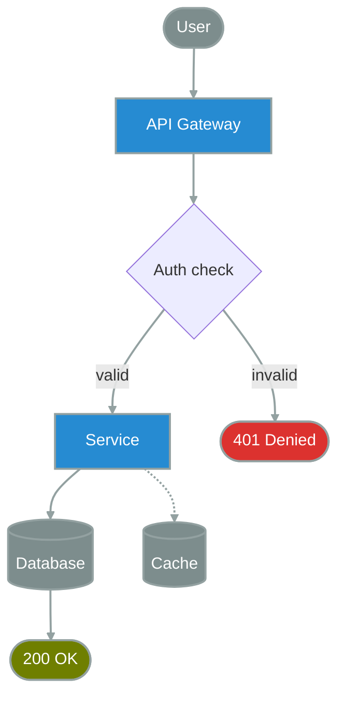

---

### 7. Tokyo Night Light

**Mode:** Light | **Source:** [github.com/enkia/tokyo-night-vscode-theme](https://github.com/enkia/tokyo-night-vscode-theme) (MIT)

**Subgraph:** `fill:#d5d6db,stroke:#9699a3,stroke-width:2px,color:#343b58`
**Edges:** `stroke:#9699a3,stroke-width:2px`

| Class | Definition |
|-------|-----------|
| primary | `fill:#34548a,stroke:#9699a3,stroke-width:2px,color:#ffffff` |
| secondary | `fill:#7f8490,stroke:#9699a3,stroke-width:2px,color:#ffffff` |
| success | `fill:#485e30,stroke:#9699a3,stroke-width:2px,color:#ffffff` |
| warning | `fill:#8f5e15,stroke:#9699a3,stroke-width:2px,color:#ffffff` |
| danger | `fill:#8c4351,stroke:#9699a3,stroke-width:2px,color:#ffffff` |
| info | `fill:#0f4b6e,stroke:#9699a3,stroke-width:2px,color:#ffffff` |
| accent | `fill:#7847bd,stroke:#9699a3,stroke-width:2px,color:#ffffff` |
| warm | `fill:#965027,stroke:#9699a3,stroke-width:2px,color:#ffffff` |
| muted | `fill:#7f8490,stroke:#9699a3,stroke-width:2px,color:#ffffff` |
| surface | `fill:#cbccd1,stroke:#9699a3,stroke-width:2px,color:#343b58` |
| external | `fill:#7f8490,stroke:#9699a3,stroke-width:2px,color:#ffffff,stroke-dasharray:5` |

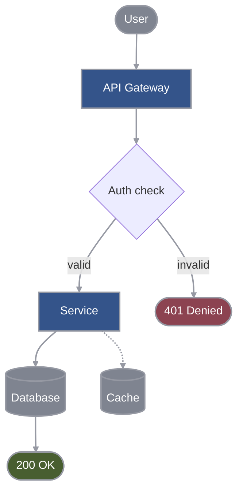

---

## Dark Themes

---

### 8. Ayu Dark

**Mode:** Dark | **Source:** [github.com/ayu-theme](https://github.com/ayu-theme) (MIT)

**Subgraph:** `fill:#0a0e14,stroke:#5C6773,stroke-width:2px,color:#B3B1AD`
**Edges:** `stroke:#B3B1AD,stroke-width:2px`

| Class | Definition |
|-------|-----------|
| primary | `fill:#E6B450,stroke:#5C6773,stroke-width:2px,color:#1a1a2e` |
| secondary | `fill:#5C6773,stroke:#4a525c,stroke-width:2px,color:#ffffff` |
| success | `fill:#AAD94C,stroke:#5C6773,stroke-width:2px,color:#1a1a2e` |
| warning | `fill:#FFB454,stroke:#5C6773,stroke-width:2px,color:#1a1a2e` |
| danger | `fill:#F07178,stroke:#5C6773,stroke-width:2px,color:#ffffff` |
| info | `fill:#59C2FF,stroke:#5C6773,stroke-width:2px,color:#1a1a2e` |
| accent | `fill:#E6B450,stroke:#5C6773,stroke-width:2px,color:#1a1a2e` |
| warm | `fill:#FFB454,stroke:#5C6773,stroke-width:2px,color:#1a1a2e` |
| muted | `fill:#5C6773,stroke:#4a525c,stroke-width:2px,color:#ffffff` |
| surface | `fill:#0f131a,stroke:#5C6773,stroke-width:2px,color:#B3B1AD` |
| external | `fill:#5C6773,stroke:#4a525c,stroke-width:2px,color:#ffffff,stroke-dasharray:5` |

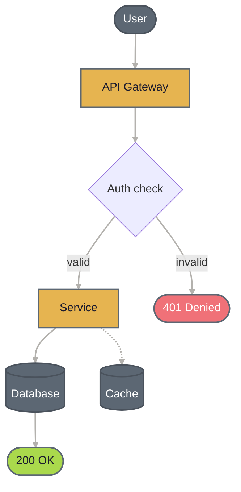

---

### 9. Ayu Mirage

**Mode:** Dark | **Source:** [github.com/ayu-theme](https://github.com/ayu-theme) (MIT)

**Subgraph:** `fill:#1f2430,stroke:#707A8C,stroke-width:2px,color:#CCCAC2`
**Edges:** `stroke:#B8CFE6,stroke-width:2px`

| Class | Definition |
|-------|-----------|
| primary | `fill:#FFCC66,stroke:#707A8C,stroke-width:2px,color:#1a1a2e` |
| secondary | `fill:#707A8C,stroke:#5a6270,stroke-width:2px,color:#ffffff` |
| success | `fill:#BAE67E,stroke:#707A8C,stroke-width:2px,color:#1a1a2e` |
| warning | `fill:#FFD580,stroke:#707A8C,stroke-width:2px,color:#1a1a2e` |
| danger | `fill:#F28779,stroke:#707A8C,stroke-width:2px,color:#ffffff` |
| info | `fill:#73D0FF,stroke:#707A8C,stroke-width:2px,color:#1a1a2e` |
| accent | `fill:#D4BFFF,stroke:#707A8C,stroke-width:2px,color:#1a1a2e` |
| warm | `fill:#FFD580,stroke:#707A8C,stroke-width:2px,color:#1a1a2e` |
| muted | `fill:#707A8C,stroke:#5a6270,stroke-width:2px,color:#ffffff` |
| surface | `fill:#232834,stroke:#707A8C,stroke-width:2px,color:#CCCAC2` |
| external | `fill:#707A8C,stroke:#5a6270,stroke-width:2px,color:#ffffff,stroke-dasharray:5` |

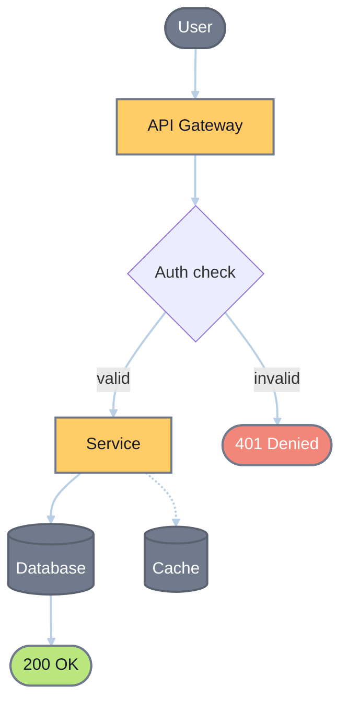

---

### 10. Catppuccin Mocha

**Mode:** Dark | **Source:** [github.com/catppuccin](https://github.com/catppuccin) (MIT)

**Subgraph:** `fill:#1e1e2e,stroke:#45475a,stroke-width:2px,color:#cdd6f4`
**Edges:** `stroke:#a6adc8,stroke-width:2px`

| Class | Definition |
|-------|-----------|
| primary | `fill:#89b4fa,stroke:#45475a,stroke-width:2px,color:#1a1a2e` |
| secondary | `fill:#6c7086,stroke:#45475a,stroke-width:2px,color:#ffffff` |
| success | `fill:#a6e3a1,stroke:#45475a,stroke-width:2px,color:#1a1a2e` |
| warning | `fill:#f9e2af,stroke:#45475a,stroke-width:2px,color:#1a1a2e` |
| danger | `fill:#f38ba8,stroke:#45475a,stroke-width:2px,color:#1a1a2e` |
| info | `fill:#89dceb,stroke:#45475a,stroke-width:2px,color:#1a1a2e` |
| accent | `fill:#cba6f7,stroke:#45475a,stroke-width:2px,color:#1a1a2e` |
| warm | `fill:#fab387,stroke:#45475a,stroke-width:2px,color:#1a1a2e` |
| muted | `fill:#6c7086,stroke:#45475a,stroke-width:2px,color:#ffffff` |
| surface | `fill:#313244,stroke:#45475a,stroke-width:2px,color:#cdd6f4` |
| external | `fill:#6c7086,stroke:#45475a,stroke-width:2px,color:#ffffff,stroke-dasharray:5` |

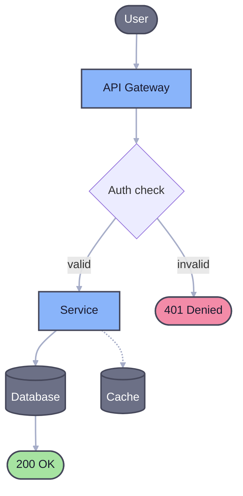

---

### 11. Dracula

**Mode:** Dark | **Source:** [github.com/dracula/dracula-theme](https://github.com/dracula/dracula-theme) (MIT)

**Subgraph:** `fill:#282a36,stroke:#6272a4,stroke-width:2px,color:#f8f8f2`
**Edges:** `stroke:#9aadce,stroke-width:2px`

| Class | Definition |
|-------|-----------|
| primary | `fill:#bd93f9,stroke:#6272a4,stroke-width:2px,color:#1a1a2e` |
| secondary | `fill:#6272a4,stroke:#4e5b83,stroke-width:2px,color:#ffffff` |
| success | `fill:#50fa7b,stroke:#6272a4,stroke-width:2px,color:#1a1a2e` |
| warning | `fill:#f1fa8c,stroke:#6272a4,stroke-width:2px,color:#1a1a2e` |
| danger | `fill:#ff5555,stroke:#6272a4,stroke-width:2px,color:#ffffff` |
| info | `fill:#8be9fd,stroke:#6272a4,stroke-width:2px,color:#1a1a2e` |
| accent | `fill:#ff79c6,stroke:#6272a4,stroke-width:2px,color:#1a1a2e` |
| warm | `fill:#ffb86c,stroke:#6272a4,stroke-width:2px,color:#1a1a2e` |
| muted | `fill:#6272a4,stroke:#4e5b83,stroke-width:2px,color:#ffffff` |
| surface | `fill:#44475a,stroke:#6272a4,stroke-width:2px,color:#f8f8f2` |
| external | `fill:#6272a4,stroke:#4e5b83,stroke-width:2px,color:#ffffff,stroke-dasharray:5` |

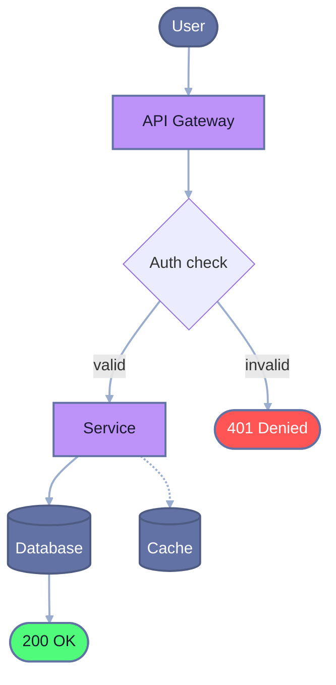

---

### 12. Everforest Dark

**Mode:** Dark | **Source:** [github.com/sainnhe/everforest](https://github.com/sainnhe/everforest) (MIT)

**Subgraph:** `fill:#272e33,stroke:#859289,stroke-width:2px,color:#d3c6aa`
**Edges:** `stroke:#9da9a0,stroke-width:2px`

| Class | Definition |
|-------|-----------|
| primary | `fill:#a7c080,stroke:#859289,stroke-width:2px,color:#1a1a2e` |
| secondary | `fill:#859289,stroke:#6a756e,stroke-width:2px,color:#ffffff` |
| success | `fill:#a7c080,stroke:#859289,stroke-width:2px,color:#1a1a2e` |
| warning | `fill:#dbbc7f,stroke:#859289,stroke-width:2px,color:#1a1a2e` |
| danger | `fill:#e67e80,stroke:#859289,stroke-width:2px,color:#ffffff` |
| info | `fill:#7fbbb3,stroke:#859289,stroke-width:2px,color:#1a1a2e` |
| accent | `fill:#d699b6,stroke:#859289,stroke-width:2px,color:#1a1a2e` |
| warm | `fill:#e69875,stroke:#859289,stroke-width:2px,color:#1a1a2e` |
| muted | `fill:#859289,stroke:#6a756e,stroke-width:2px,color:#ffffff` |
| surface | `fill:#2e383c,stroke:#859289,stroke-width:2px,color:#d3c6aa` |
| external | `fill:#859289,stroke:#6a756e,stroke-width:2px,color:#ffffff,stroke-dasharray:5` |

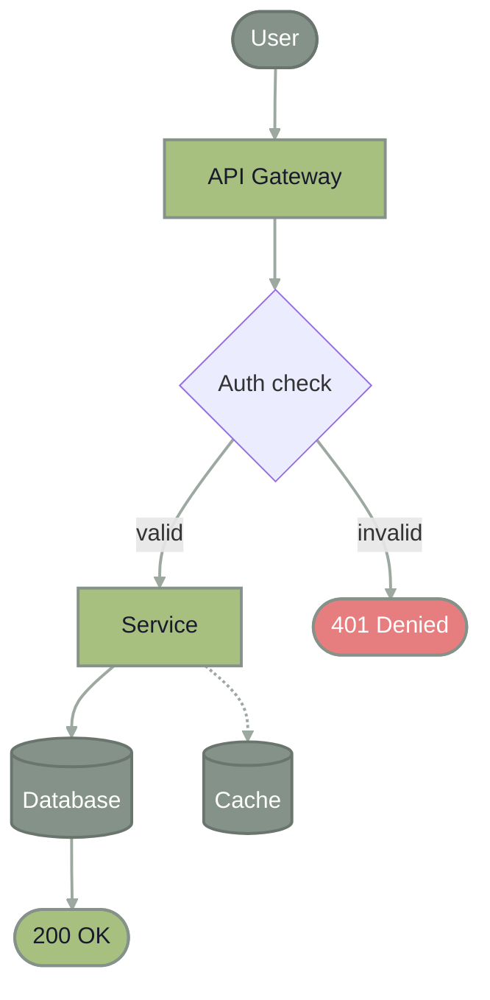

---

### 13. Gruvbox Dark

**Mode:** Dark | **Source:** [github.com/morhetz/gruvbox](https://github.com/morhetz/gruvbox) (MIT)

**Subgraph:** `fill:#282828,stroke:#928374,stroke-width:2px,color:#ebdbb2`
**Edges:** `stroke:#a89984,stroke-width:2px`

| Class | Definition |
|-------|-----------|
| primary | `fill:#83a598,stroke:#928374,stroke-width:2px,color:#1a1a2e` |
| secondary | `fill:#928374,stroke:#75695d,stroke-width:2px,color:#ffffff` |
| success | `fill:#b8bb26,stroke:#928374,stroke-width:2px,color:#1a1a2e` |
| warning | `fill:#fabd2f,stroke:#928374,stroke-width:2px,color:#1a1a2e` |
| danger | `fill:#fb4934,stroke:#928374,stroke-width:2px,color:#ffffff` |
| info | `fill:#8ec07c,stroke:#928374,stroke-width:2px,color:#1a1a2e` |
| accent | `fill:#d3869b,stroke:#928374,stroke-width:2px,color:#1a1a2e` |
| warm | `fill:#fe8019,stroke:#928374,stroke-width:2px,color:#1a1a2e` |
| muted | `fill:#928374,stroke:#75695d,stroke-width:2px,color:#ffffff` |
| surface | `fill:#3c3836,stroke:#928374,stroke-width:2px,color:#ebdbb2` |
| external | `fill:#928374,stroke:#75695d,stroke-width:2px,color:#ffffff,stroke-dasharray:5` |

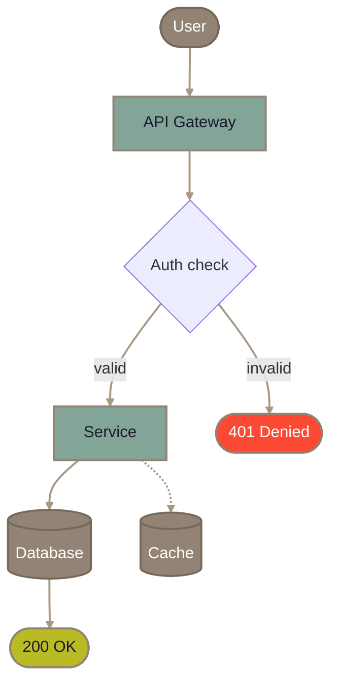

---

### 14. Horizon Dark

**Mode:** Dark | **Source:** [github.com/jolaleye/horizon-theme-vscode](https://github.com/jolaleye/horizon-theme-vscode) (MIT)

**Subgraph:** `fill:#1c1e26,stroke:#6C6F93,stroke-width:2px,color:#d5d8e0`
**Edges:** `stroke:#9a9dba,stroke-width:2px`

| Class | Definition |
|-------|-----------|
| primary | `fill:#E95678,stroke:#6C6F93,stroke-width:2px,color:#ffffff` |
| secondary | `fill:#6C6F93,stroke:#565876,stroke-width:2px,color:#ffffff` |
| success | `fill:#29D398,stroke:#6C6F93,stroke-width:2px,color:#1a1a2e` |
| warning | `fill:#FAB795,stroke:#6C6F93,stroke-width:2px,color:#1a1a2e` |
| danger | `fill:#E95678,stroke:#6C6F93,stroke-width:2px,color:#ffffff` |
| info | `fill:#25B0BC,stroke:#6C6F93,stroke-width:2px,color:#ffffff` |
| accent | `fill:#B877DB,stroke:#6C6F93,stroke-width:2px,color:#1a1a2e` |
| warm | `fill:#FAC29A,stroke:#6C6F93,stroke-width:2px,color:#1a1a2e` |
| muted | `fill:#6C6F93,stroke:#565876,stroke-width:2px,color:#ffffff` |
| surface | `fill:#232530,stroke:#6C6F93,stroke-width:2px,color:#d5d8e0` |
| external | `fill:#6C6F93,stroke:#565876,stroke-width:2px,color:#ffffff,stroke-dasharray:5` |

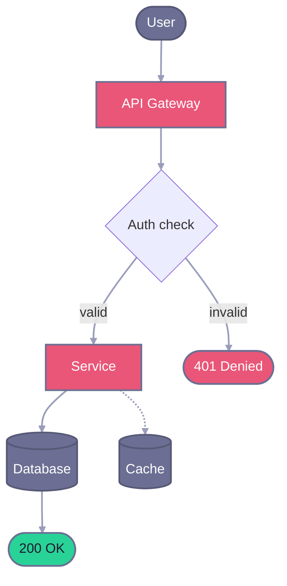

---

### 15. Kanagawa

**Mode:** Dark | **Source:** [github.com/rebelot/kanagawa.nvim](https://github.com/rebelot/kanagawa.nvim) (MIT)

**Subgraph:** `fill:#1f1f28,stroke:#727169,stroke-width:2px,color:#dcd7ba`
**Edges:** `stroke:#9a978a,stroke-width:2px`

| Class | Definition |
|-------|-----------|
| primary | `fill:#7E9CD8,stroke:#727169,stroke-width:2px,color:#1a1a2e` |
| secondary | `fill:#727169,stroke:#5b5a54,stroke-width:2px,color:#ffffff` |
| success | `fill:#98BB6C,stroke:#727169,stroke-width:2px,color:#1a1a2e` |
| warning | `fill:#E6C384,stroke:#727169,stroke-width:2px,color:#1a1a2e` |
| danger | `fill:#FF5D62,stroke:#727169,stroke-width:2px,color:#ffffff` |
| info | `fill:#7FB4CA,stroke:#727169,stroke-width:2px,color:#1a1a2e` |
| accent | `fill:#957FB8,stroke:#727169,stroke-width:2px,color:#ffffff` |
| warm | `fill:#FFA066,stroke:#727169,stroke-width:2px,color:#1a1a2e` |
| muted | `fill:#727169,stroke:#5b5a54,stroke-width:2px,color:#ffffff` |
| surface | `fill:#2a2a37,stroke:#727169,stroke-width:2px,color:#dcd7ba` |
| external | `fill:#727169,stroke:#5b5a54,stroke-width:2px,color:#ffffff,stroke-dasharray:5` |

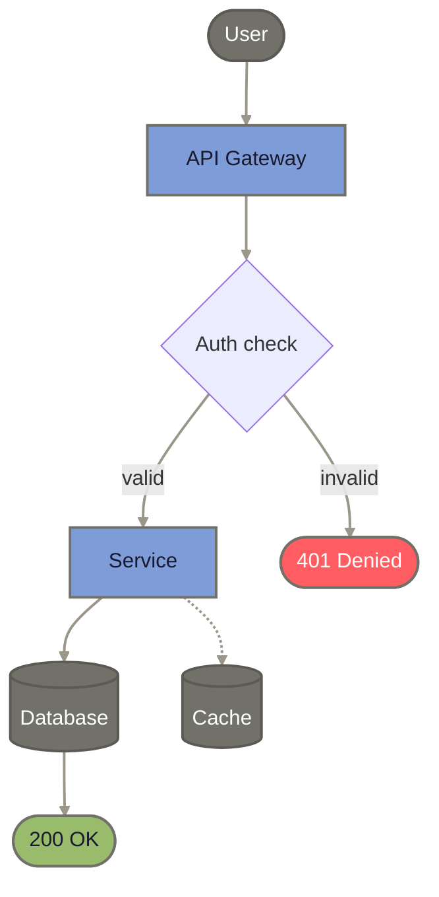

---

### 16. Material Dark

**Mode:** Dark | **Source:** [github.com/material-theme](https://github.com/material-theme) (MIT)

**Subgraph:** `fill:#263238,stroke:#546E7A,stroke-width:2px,color:#EEFFFF`
**Edges:** `stroke:#B0BEC5,stroke-width:2px`

| Class | Definition |
|-------|-----------|
| primary | `fill:#82AAFF,stroke:#546E7A,stroke-width:2px,color:#1a1a2e` |
| secondary | `fill:#546E7A,stroke:#435862,stroke-width:2px,color:#ffffff` |
| success | `fill:#C3E88D,stroke:#546E7A,stroke-width:2px,color:#1a1a2e` |
| warning | `fill:#FFCB6B,stroke:#546E7A,stroke-width:2px,color:#1a1a2e` |
| danger | `fill:#F07178,stroke:#546E7A,stroke-width:2px,color:#ffffff` |
| info | `fill:#89DDFF,stroke:#546E7A,stroke-width:2px,color:#1a1a2e` |
| accent | `fill:#C792EA,stroke:#546E7A,stroke-width:2px,color:#1a1a2e` |
| warm | `fill:#F78C6C,stroke:#546E7A,stroke-width:2px,color:#1a1a2e` |
| muted | `fill:#546E7A,stroke:#435862,stroke-width:2px,color:#ffffff` |
| surface | `fill:#2c3b41,stroke:#546E7A,stroke-width:2px,color:#EEFFFF` |
| external | `fill:#546E7A,stroke:#435862,stroke-width:2px,color:#ffffff,stroke-dasharray:5` |


---

### 17. Monokai Pro

**Mode:** Dark | **Source:** [monokai.pro](https://monokai.pro) (MIT)

**Subgraph:** `fill:#2d2a2e,stroke:#727072,stroke-width:2px,color:#fcfcfa`
**Edges:** `stroke:#939293,stroke-width:2px`

| Class | Definition |
|-------|-----------|
| primary | `fill:#FFD866,stroke:#727072,stroke-width:2px,color:#1a1a2e` |
| secondary | `fill:#727072,stroke:#5b595b,stroke-width:2px,color:#ffffff` |
| success | `fill:#A9DC76,stroke:#727072,stroke-width:2px,color:#1a1a2e` |
| warning | `fill:#FFD866,stroke:#727072,stroke-width:2px,color:#1a1a2e` |
| danger | `fill:#FF6188,stroke:#727072,stroke-width:2px,color:#ffffff` |
| info | `fill:#78DCE8,stroke:#727072,stroke-width:2px,color:#1a1a2e` |
| accent | `fill:#AB9DF2,stroke:#727072,stroke-width:2px,color:#1a1a2e` |
| warm | `fill:#FC9867,stroke:#727072,stroke-width:2px,color:#1a1a2e` |
| muted | `fill:#727072,stroke:#5b595b,stroke-width:2px,color:#ffffff` |
| surface | `fill:#403e41,stroke:#727072,stroke-width:2px,color:#fcfcfa` |
| external | `fill:#727072,stroke:#5b595b,stroke-width:2px,color:#ffffff,stroke-dasharray:5` |

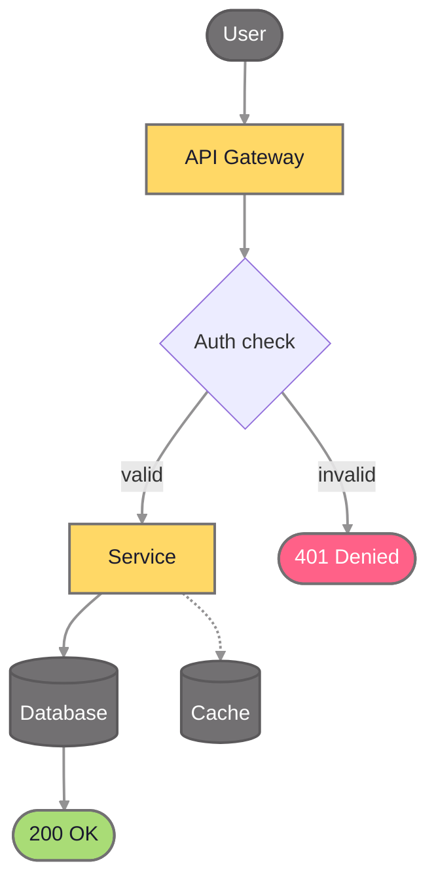

---

### 18. Nord

**Mode:** Dark | **Source:** [github.com/nordtheme](https://github.com/nordtheme) (MIT)

**Subgraph:** `fill:#2e3440,stroke:#4C566A,stroke-width:2px,color:#d8dee9`
**Edges:** `stroke:#8892a8,stroke-width:2px`

| Class | Definition |
|-------|-----------|
| primary | `fill:#88C0D0,stroke:#4C566A,stroke-width:2px,color:#1a1a2e` |
| secondary | `fill:#4C566A,stroke:#3d4555,stroke-width:2px,color:#ffffff` |
| success | `fill:#A3BE8C,stroke:#4C566A,stroke-width:2px,color:#1a1a2e` |
| warning | `fill:#EBCB8B,stroke:#4C566A,stroke-width:2px,color:#1a1a2e` |
| danger | `fill:#BF616A,stroke:#4C566A,stroke-width:2px,color:#ffffff` |
| info | `fill:#81A1C1,stroke:#4C566A,stroke-width:2px,color:#1a1a2e` |
| accent | `fill:#B48EAD,stroke:#4C566A,stroke-width:2px,color:#1a1a2e` |
| warm | `fill:#D08770,stroke:#4C566A,stroke-width:2px,color:#1a1a2e` |
| muted | `fill:#4C566A,stroke:#3d4555,stroke-width:2px,color:#ffffff` |
| surface | `fill:#3b4252,stroke:#4C566A,stroke-width:2px,color:#d8dee9` |
| external | `fill:#4C566A,stroke:#3d4555,stroke-width:2px,color:#ffffff,stroke-dasharray:5` |

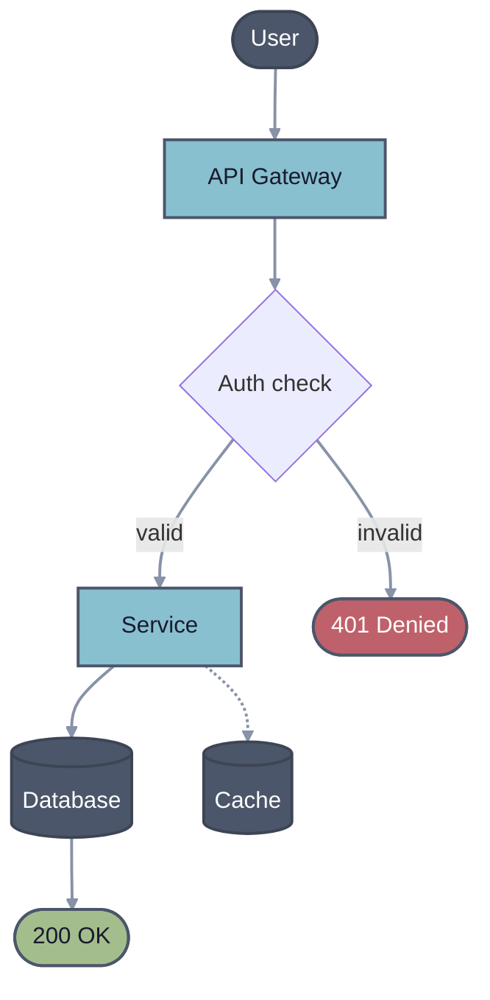

---

### 19. One Dark

**Mode:** Dark | **Source:** [github.com/Binaryify/OneDark-Pro](https://github.com/Binaryify/OneDark-Pro) (MIT)

**Subgraph:** `fill:#282c34,stroke:#5C6370,stroke-width:2px,color:#abb2bf`
**Edges:** `stroke:#8b919e,stroke-width:2px`

| Class | Definition |
|-------|-----------|
| primary | `fill:#61AFEF,stroke:#5C6370,stroke-width:2px,color:#1a1a2e` |
| secondary | `fill:#5C6370,stroke:#4a4f5a,stroke-width:2px,color:#ffffff` |
| success | `fill:#98C379,stroke:#5C6370,stroke-width:2px,color:#1a1a2e` |
| warning | `fill:#E5C07B,stroke:#5C6370,stroke-width:2px,color:#1a1a2e` |
| danger | `fill:#E06C75,stroke:#5C6370,stroke-width:2px,color:#ffffff` |
| info | `fill:#56B6C2,stroke:#5C6370,stroke-width:2px,color:#1a1a2e` |
| accent | `fill:#C678DD,stroke:#5C6370,stroke-width:2px,color:#1a1a2e` |
| warm | `fill:#D19A66,stroke:#5C6370,stroke-width:2px,color:#1a1a2e` |
| muted | `fill:#5C6370,stroke:#4a4f5a,stroke-width:2px,color:#ffffff` |
| surface | `fill:#2c313a,stroke:#5C6370,stroke-width:2px,color:#abb2bf` |
| external | `fill:#5C6370,stroke:#4a4f5a,stroke-width:2px,color:#ffffff,stroke-dasharray:5` |

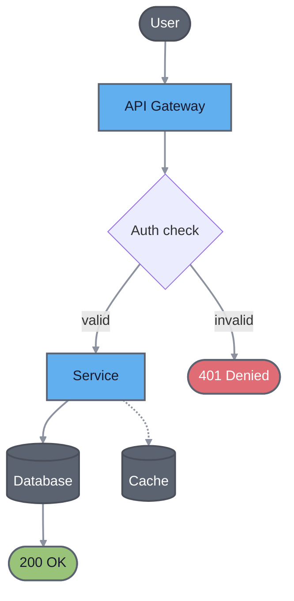

---

### 20. Palenight

**Mode:** Dark | **Source:** [github.com/material-theme](https://github.com/material-theme) (MIT)

**Subgraph:** `fill:#292d3e,stroke:#676E95,stroke-width:2px,color:#a6accd`
**Edges:** `stroke:#9499bb,stroke-width:2px`

| Class | Definition |
|-------|-----------|
| primary | `fill:#82AAFF,stroke:#676E95,stroke-width:2px,color:#1a1a2e` |
| secondary | `fill:#676E95,stroke:#525877,stroke-width:2px,color:#ffffff` |
| success | `fill:#C3E88D,stroke:#676E95,stroke-width:2px,color:#1a1a2e` |
| warning | `fill:#FFCB6B,stroke:#676E95,stroke-width:2px,color:#1a1a2e` |
| danger | `fill:#F07178,stroke:#676E95,stroke-width:2px,color:#ffffff` |
| info | `fill:#89DDFF,stroke:#676E95,stroke-width:2px,color:#1a1a2e` |
| accent | `fill:#C792EA,stroke:#676E95,stroke-width:2px,color:#1a1a2e` |
| warm | `fill:#F78C6C,stroke:#676E95,stroke-width:2px,color:#1a1a2e` |
| muted | `fill:#676E95,stroke:#525877,stroke-width:2px,color:#ffffff` |
| surface | `fill:#32374d,stroke:#676E95,stroke-width:2px,color:#a6accd` |
| external | `fill:#676E95,stroke:#525877,stroke-width:2px,color:#ffffff,stroke-dasharray:5` |


---

### 21. Rose Pine

**Mode:** Dark | **Source:** [github.com/rose-pine](https://github.com/rose-pine) (MIT)

**Subgraph:** `fill:#191724,stroke:#6e6a86,stroke-width:2px,color:#e0def4`
**Edges:** `stroke:#908caa,stroke-width:2px`

| Class | Definition |
|-------|-----------|
| primary | `fill:#c4a7e7,stroke:#6e6a86,stroke-width:2px,color:#1a1a2e` |
| secondary | `fill:#6e6a86,stroke:#58556b,stroke-width:2px,color:#ffffff` |
| success | `fill:#9ccfd8,stroke:#6e6a86,stroke-width:2px,color:#1a1a2e` |
| warning | `fill:#f6c177,stroke:#6e6a86,stroke-width:2px,color:#1a1a2e` |
| danger | `fill:#eb6f92,stroke:#6e6a86,stroke-width:2px,color:#ffffff` |
| info | `fill:#31748f,stroke:#6e6a86,stroke-width:2px,color:#ffffff` |
| accent | `fill:#ebbcba,stroke:#6e6a86,stroke-width:2px,color:#1a1a2e` |
| warm | `fill:#f6c177,stroke:#6e6a86,stroke-width:2px,color:#1a1a2e` |
| muted | `fill:#6e6a86,stroke:#58556b,stroke-width:2px,color:#ffffff` |
| surface | `fill:#1f1d2e,stroke:#6e6a86,stroke-width:2px,color:#e0def4` |
| external | `fill:#6e6a86,stroke:#58556b,stroke-width:2px,color:#ffffff,stroke-dasharray:5` |

```mermaid
flowchart TD
    user(["User"]) ==> api["API Gateway"] ==> auth{"Auth check"}
    auth == valid ==> svc["Service"] ==> db[("Database")] ==> res(["200 OK"])
    auth -- invalid --> err(["401 Denied"])
    svc -.-> cache[("Cache")]

    classDef primary fill:#c4a7e7,stroke:#6e6a86,stroke-width:2px,color:#1a1a2e
    classDef muted fill:#6e6a86,stroke:#58556b,stroke-width:2px,color:#ffffff
    classDef success fill:#9ccfd8,stroke:#6e6a86,stroke-width:2px,color:#1a1a2e
    classDef danger fill:#eb6f92,stroke:#6e6a86,stroke-width:2px,color:#ffffff
    linkStyle default stroke:#908caa,stroke-width:2px

    class api,svc primary
    class user,db,cache muted
    class res success
    class err danger
```

---

### 22. Synthwave '84

**Mode:** Dark | **Source:** [github.com/robb0wen/synthwave-vscode](https://github.com/robb0wen/synthwave-vscode) (MIT)

**Subgraph:** `fill:#262335,stroke:#495495,stroke-width:2px,color:#ffffff`
**Edges:** `stroke:#848bbd,stroke-width:2px`

| Class | Definition |
|-------|-----------|
| primary | `fill:#FF7EDB,stroke:#495495,stroke-width:2px,color:#1a1a2e` |
| secondary | `fill:#495495,stroke:#3a4377,stroke-width:2px,color:#ffffff` |
| success | `fill:#72F1B8,stroke:#495495,stroke-width:2px,color:#1a1a2e` |
| warning | `fill:#FEDE5D,stroke:#495495,stroke-width:2px,color:#1a1a2e` |
| danger | `fill:#FE4450,stroke:#495495,stroke-width:2px,color:#ffffff` |
| info | `fill:#36F9F6,stroke:#495495,stroke-width:2px,color:#1a1a2e` |
| accent | `fill:#FF7EDB,stroke:#495495,stroke-width:2px,color:#1a1a2e` |
| warm | `fill:#F97E72,stroke:#495495,stroke-width:2px,color:#1a1a2e` |
| muted | `fill:#495495,stroke:#3a4377,stroke-width:2px,color:#ffffff` |
| surface | `fill:#2a2139,stroke:#495495,stroke-width:2px,color:#ffffff` |
| external | `fill:#495495,stroke:#3a4377,stroke-width:2px,color:#ffffff,stroke-dasharray:5` |

```mermaid
flowchart TD
    user(["User"]) ==> api["API Gateway"] ==> auth{"Auth check"}
    auth == valid ==> svc["Service"] ==> db[("Database")] ==> res(["200 OK"])
    auth -- invalid --> err(["401 Denied"])
    svc -.-> cache[("Cache")]

    classDef primary fill:#FF7EDB,stroke:#495495,stroke-width:2px,color:#1a1a2e
    classDef muted fill:#495495,stroke:#3a4377,stroke-width:2px,color:#ffffff
    classDef success fill:#72F1B8,stroke:#495495,stroke-width:2px,color:#1a1a2e
    classDef danger fill:#FE4450,stroke:#495495,stroke-width:2px,color:#ffffff
    linkStyle default stroke:#848bbd,stroke-width:2px

    class api,svc primary
    class user,db,cache muted
    class res success
    class err danger
```

---

### 23. Tokyo Night

**Mode:** Dark | **Source:** [github.com/enkia/tokyo-night-vscode-theme](https://github.com/enkia/tokyo-night-vscode-theme) (MIT)

**Subgraph:** `fill:#1a1b26,stroke:#565F89,stroke-width:2px,color:#a9b1d6`
**Edges:** `stroke:#9aa5ce,stroke-width:2px`

| Class | Definition |
|-------|-----------|
| primary | `fill:#7AA2F7,stroke:#565F89,stroke-width:2px,color:#1a1a2e` |
| secondary | `fill:#565F89,stroke:#454c6e,stroke-width:2px,color:#ffffff` |
| success | `fill:#9ECE6A,stroke:#565F89,stroke-width:2px,color:#1a1a2e` |
| warning | `fill:#E0AF68,stroke:#565F89,stroke-width:2px,color:#1a1a2e` |
| danger | `fill:#F7768E,stroke:#565F89,stroke-width:2px,color:#ffffff` |
| info | `fill:#7DCFFF,stroke:#565F89,stroke-width:2px,color:#1a1a2e` |
| accent | `fill:#BB9AF7,stroke:#565F89,stroke-width:2px,color:#1a1a2e` |
| warm | `fill:#FF9E64,stroke:#565F89,stroke-width:2px,color:#1a1a2e` |
| muted | `fill:#565F89,stroke:#454c6e,stroke-width:2px,color:#ffffff` |
| surface | `fill:#24283b,stroke:#565F89,stroke-width:2px,color:#a9b1d6` |
| external | `fill:#565F89,stroke:#454c6e,stroke-width:2px,color:#ffffff,stroke-dasharray:5` |

```mermaid
flowchart TD
    user(["User"]) ==> api["API Gateway"] ==> auth{"Auth check"}
    auth == valid ==> svc["Service"] ==> db[("Database")] ==> res(["200 OK"])
    auth -- invalid --> err(["401 Denied"])
    svc -.-> cache[("Cache")]

    classDef primary fill:#7AA2F7,stroke:#565F89,stroke-width:2px,color:#1a1a2e
    classDef muted fill:#565F89,stroke:#454c6e,stroke-width:2px,color:#ffffff
    classDef success fill:#9ECE6A,stroke:#565F89,stroke-width:2px,color:#1a1a2e
    classDef danger fill:#F7768E,stroke:#565F89,stroke-width:2px,color:#ffffff
    linkStyle default stroke:#9aa5ce,stroke-width:2px

    class api,svc primary
    class user,db,cache muted
    class res success
    class err danger
```

---

### 24. Tokyo Night Storm

**Mode:** Dark | **Source:** [github.com/enkia/tokyo-night-vscode-theme](https://github.com/enkia/tokyo-night-vscode-theme) (MIT)

**Subgraph:** `fill:#24283b,stroke:#565F89,stroke-width:2px,color:#a9b1d6`
**Edges:** `stroke:#9aa5ce,stroke-width:2px`

| Class | Definition |
|-------|-----------|
| primary | `fill:#7AA2F7,stroke:#565F89,stroke-width:2px,color:#1a1a2e` |
| secondary | `fill:#565F89,stroke:#454c6e,stroke-width:2px,color:#ffffff` |
| success | `fill:#9ECE6A,stroke:#565F89,stroke-width:2px,color:#1a1a2e` |
| warning | `fill:#E0AF68,stroke:#565F89,stroke-width:2px,color:#1a1a2e` |
| danger | `fill:#F7768E,stroke:#565F89,stroke-width:2px,color:#ffffff` |
| info | `fill:#7DCFFF,stroke:#565F89,stroke-width:2px,color:#1a1a2e` |
| accent | `fill:#BB9AF7,stroke:#565F89,stroke-width:2px,color:#1a1a2e` |
| warm | `fill:#FF9E64,stroke:#565F89,stroke-width:2px,color:#1a1a2e` |
| muted | `fill:#565F89,stroke:#454c6e,stroke-width:2px,color:#ffffff` |
| surface | `fill:#292e42,stroke:#565F89,stroke-width:2px,color:#a9b1d6` |
| external | `fill:#565F89,stroke:#454c6e,stroke-width:2px,color:#ffffff,stroke-dasharray:5` |

```mermaid
flowchart TD
    user(["User"]) ==> api["API Gateway"] ==> auth{"Auth check"}
    auth == valid ==> svc["Service"] ==> db[("Database")] ==> res(["200 OK"])
    auth -- invalid --> err(["401 Denied"])
    svc -.-> cache[("Cache")]

    classDef primary fill:#7AA2F7,stroke:#565F89,stroke-width:2px,color:#1a1a2e
    classDef muted fill:#565F89,stroke:#454c6e,stroke-width:2px,color:#ffffff
    classDef success fill:#9ECE6A,stroke:#565F89,stroke-width:2px,color:#1a1a2e
    classDef danger fill:#F7768E,stroke:#565F89,stroke-width:2px,color:#ffffff
    linkStyle default stroke:#9aa5ce,stroke-width:2px

    class api,svc primary
    class user,db,cache muted
    class res success
    class err danger
```
